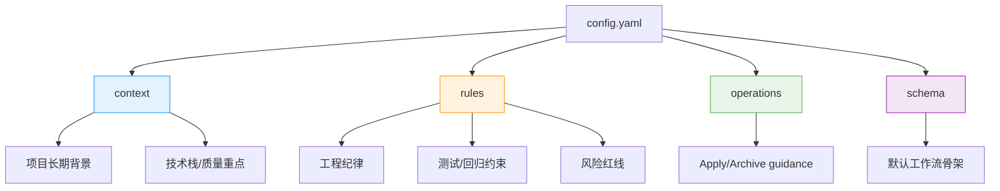

# 06 · 高级：`config.yaml` 怎么写到真正好用

> 到了这一步，问题已经不是"全局约束该放哪"，而是更现实的一层：
> **就算我知道它们该放进 `config.yaml`，那我到底该怎么写，才不会写成一堆正确但无用的话？**

> **配置路由。** `context` 进入 artifact instructions，也进入 Apply/Archive；`rules.<artifact>` 只进入同名 artifact；Apply/Archive 专属的短稳定步骤写到 `operations.apply/archive.guidance`。`init --language` 只是创建新 config 时写入语言 context 的快捷入口；`schema init --default` 写入有效 `schema` 键（不再写无效的 `defaultSchema`）。

本章是手册内唯一维护**可复制 YAML、字段消费者和验证命令**的配置写法页；[05](05-高级-项目级全局约束到底放哪.md) 只负责先判断一条信息该不该进入项目层。

---

## 这一篇解决什么问题

很多团队第一次写 `openspec/config.yaml` 时，都会落入两种极端：

### 极端 1：写得太少

比如只写：

```yaml
schema: spec-driven
```

这当然不算错。

但它几乎没有给项目提供任何真正的工程约束。

### 极端 2：写得太空

比如写一堆看起来很高级的话：

```yaml
rules:
  proposal:
    - Keep code clean
    - Follow best practices
  specs:
    - Write good tests
  design:
    - Maintain code quality
```

这种写法的问题是：

- 谁都不会反对
- 但谁也不知道它具体意味着什么
- AI 看了也很难据此做更稳定的判断

所以真正难的不是"有没有 `config.yaml`"，而是：

> **怎样把它写成一份对项目真的有约束力、对 AI 真的有帮助的配置。**

---

## 先钉住一个总原则

好的 `config.yaml` 不是产品需求文档，也不是团队口号板。

它更像：

- 项目级长期背景
- 项目级工程宪法
- 默认 change 写作与实施的稳定前提

所以写它时最该问的不是：

- "还有什么能往里塞？"

而是：

- "哪些信息一旦长期稳定地写在这里，会显著提高后续所有 change 的质量？"

---

## 一份真正好用的 `config.yaml`，通常有 3 个特征

| 特征 | 一句话 | 反例（不该进 config.yaml） |
|---|---|---|
| 高杠杆 | 一条规则一旦写进去，会影响很多 change | 只对单个 change 有意义的事 |
| 可判断 | 有对象、有范围、有判断方向（如"审批改动必须守授权回归"） | 空泛口号（如"要有完善测试"） |
| 长期稳定 | 跨 change 长期成立，不是一次性的 | "这次加一个异步 worker"、"这次补 3 个集成测试" |

下面三条展开：

### 1. 它写的是"高杠杆信息"

也就是一条规则一旦写进去，会影响很多 change。

比如：

- 目录按能力域组织
- 审批相关改动必须守住授权回归
- 用户可见行为变更需要 unhappy path

这些都属于高杠杆信息。

### 2. 它写的是"可判断的信息"

好的规则会让人和 AI 在面对具体 change 时，知道该怎么判断。

比如：

- "审批相关改动必须保住授权 regression"

就比：

- "要有完善测试"

强得多。

因为前者有对象、有范围、有判断方向。

### 3. 它写的是"长期稳定的信息"

如果一条内容只对当前 change 有意义，就不该上升为项目全局配置。

比如：

- "这次加一个异步 worker"
- "这次补 3 个集成测试"

这些都不该进 `config.yaml`。

---

## 一个最实用的写法框架

我建议大多数项目都用下面这种最朴素也最稳的结构：

```yaml
schema: spec-driven

context: |
  ...

rules:
  proposal:
    - ...
  specs:
    - ...
  design:
    - ...

operations:
  apply:
    guidance:
      - Run the relevant checks before marking a task complete.
  archive:
    guidance:
      - Confirm required release evidence before archive.
```

这里的重点不在字段多少，而在于分工清晰：

- `schema`：默认 change 结构选择
- `context`：项目长期背景
- `rules`：项目长期工程纪律
- `operations`：Apply/Archive 的项目级短稳定步骤

只要这三层不混，`config.yaml` 就比较容易保持质量。

### 一张图记住三层分工



---

## `context` 到底该怎么写

`context` 最常见的问题不是少，而是乱。

### 多语言：greenfield 用 flag，brownfield 手改 context

本节是手册中多语言配置的单一事实源。判断只看 config 是否已经存在：

| 项目状态 | 做法 | 原因 |
|---|---|---|
| 尚无 `openspec/config.yaml` | `openspec init --language "Portuguese (pt-BR)"` | CLI 创建 config 并写入标准语言 context |
| 已有 config，尚未写语言约束 | 手工合并到现有 `context: |` | `--language` 会拒绝覆盖，避免丢掉项目背景 |
| 已有完全相同的三行 context | 可重复运行 init；不会改写内容 | 已满足同一语言种子 |
| 想翻译结构 heading / `SHALL` / `MUST` | 不要这样做 | prose 可本地化；parser 契约词保持英文 |

greenfield 的完整命令与结果：

```bash
openspec init --tools none --language "Portuguese (pt-BR)"
```

```yaml
schema: spec-driven
context: |
  Language: Portuguese (pt-BR)
  All artifacts must be written in Portuguese (pt-BR).
  Keep OpenSpec structural headings and SHALL/MUST keywords in English.
```

brownfield 项目则保留原 context，把语言约束合并进去：

```yaml
schema: spec-driven
context: |
  Project: BuildFlow
  Stack: TypeScript, React, Node.js
  Language: 简体中文
  All artifacts must be written in 简体中文.
  Keep OpenSpec structural headings and SHALL/MUST keywords in English.
```

合法的本地化 spec 仍长这样：

```markdown
## ADDED Requirements

### Requirement: 导出任务
系统 SHALL 允许有权限的用户导出当前筛选结果。

#### Scenario: 导出当前筛选结果
- **WHEN** 用户点击导出
- **THEN** 系统返回与筛选条件一致的 CSV
```

`--language` 的值会先 trim；空值、多行、控制字符、双向/不可见格式字符会失败，序列化后的 context 也受项目 context 大小上限约束。这个 flag 不翻译已有 artifacts，也不改变 schema/template；它只把三行提示写进新 config，后续由 instructions consumer 传给 agent。

很多人会把 `context` 写成：

- 产品 PRD 摘要
- 当前这个 sprint 的临时目标
- 一堆不稳定的细节

这都不太好。

### `context` 更适合写什么

- 项目是什么
- 核心领域是什么
- 技术栈是什么
- 哪些质量属性特别重要
- 有没有兼容性、审计性、可靠性等长期背景

### 一个较弱的 `context`

```yaml
context: |
  This project is a web app.
```

这太空了。

### 一个更强的 `context`

```yaml
context: |
  Project: BuildFlow
  Domain: Construction work inspection request and approval platform
  Stack: TypeScript, React, Node.js, PostgreSQL
  Quality priorities:
  - correctness of approval decisions
  - auditability of critical actions
  - maintainable domain boundaries
  Compatibility:
  - avoid breaking existing public APIs once published
```

这段的价值在于，它给了 AI 和人一套长期稳定的判断背景：

- 这是审批型系统，不是娱乐型产品
- 审批正确性和审计是重点
- 模块边界很重要

这种背景会直接影响：

- spec 怎么写
- design 怎么取舍
- regression 怎么想

### `context` 不是 capability 总目录

当项目已经有几十份 main specs 时，很容易想把所有 capability path、摘要和依赖关系抄进 `context`，希望 agent 每次都“全知道”。这通常会让 `context` 变成过期、冗长的第二基线；nested path 也不会自动把相关 spec 检索进来。

更稳的做法是把信息分成三层：

```text
config.context      = 跨所有 change 的短原则，例如兼容性、安全、path 必须稳定
catalog             = path + Purpose + keywords 的薄导航表，可搜索、按需读
main spec           = 完整 requirements / scenarios，唯一行为真相
```

例如，`context` 可以只写：

```yaml
context: |
  Capability paths follow the project convention in AGENTS.
  Treat a capability path as stable identity; structural migrations require an explicit rebaseline.
  Main specs are the behavior source of truth. The catalog is navigation only.
```

随后把 catalog 放在 `openspec/specs/README.md` 或项目文档中，让 agent 在 propose 前按需读取。不要把完整 catalog 或 spec 正文复制进这段 YAML。

---

## `rules` 到底该怎么写

`rules` 是最容易沦为口号区的地方。

想写好它，最重要的是把"抽象正确"写成"可执行约束"。

### 一个很弱的规则

```yaml
rules:
  proposal:
    - Write clean code
  specs:
    - Test carefully
  tasks:
    - Avoid bugs
```

它的问题是：

- 太空
- 没有作用对象
- 没有触发条件
- 没有判断方向

### 一个更强的规则

```yaml
rules:
  design:
    - Keep code organized by domain capability first, not by technical layer only
    - Do not bypass published domain interfaces with cross-module internal imports
  specs:
    - Reflect new user-visible behavior in OpenSpec artifacts before or during implementation
  tasks:
    - Core approval logic should be developed test-first when feasible
    - Approval-related changes must preserve authorization regression coverage
```

这组规则更强，是因为它们更像真实项目里的判断依据。

它们告诉你：

- 什么是好的目录演化方向
- 什么类型的改动必须先补 artifact
- 哪些逻辑最好 test-first
- 哪类 regression 绝不能掉
- 哪种实现方式属于架构违规

对 capability discovery，还可以加入两条真正可执行的 artifact rules：

```yaml
rules:
  proposal:
    - Classify every affected capability as New or Modified and record discovery evidence.
  specs:
    - Use the exact capability path declared in the proposal.
    - Do not create a near-duplicate capability without checking the catalog and existing main specs.
```

这些 rules 只约束 proposal/specs 生成；Apply 不会重新收到它们。需要 Apply/Archive 的稳定检查，仍放 `operations.apply/archive.guidance`；需要不可绕过的约束，仍要靠 schema、测试或 CI。

### 条件化知识不要靠长 context 猜，先在 proposal 留一张 Context Card

风险等级、policy、runtime owner 或跨域影响往往不是每个 change 都适用。把它们全部写进 context，会让不相关的 artifact 也背负长提示；只写短 rule 又可能让后续作者不知道这次到底命中了什么。

正确做法是：`rules.proposal` 只要求**分类并留痕**，由 proposal 保存本次的 Context Card：

```markdown
## Change Context Card

- Change class: <domain / risk class>
- Affected capabilities and authority owners: ...
- Applicable policies / canonical sources read: ...
- Excluded domains and why: ...
- Required verification evidence: ...
```

随后让各 artifact 承接自己的部分：specs/design 会直接读取 proposal，分别把行为合同、技术 owner、风险和证据要求落地；tasks 只直接读取 specs/design，因此必须把要实施的分类结论具体化到这两份文件和 tasks，不能期待 Context Card 自动穿透 DAG。Apply 最终读取当前已落盘的 artifacts；这比让它重新从全局 context 猜一次可靠得多。

如果每个 change 都必须有这张 card，把它写入 proposal template；如果需要独立审查状态或不同依赖关系，再升级为自定义 schema artifact。不要发明没有 consumer 的 `stage_context:` 字段。

---

## 把"空规则"改写成"强规则"

这一步最值钱。

下面给几组常见改写。

### 从弱到强 1

弱：

```text
Write good tests
```

强：

```text
Changes affecting approval decisions must preserve authorization regression coverage.
```

为什么更好：

- 有明确作用对象：approval decisions
- 有明确要求：preserve regression coverage

---

### 从弱到强 2

弱：

```text
Keep code clean
```

强：

```text
Keep code grouped by domain capability first, and avoid cross-module imports that bypass published interfaces.
```

为什么更好：

- "clean" 被具体化成结构和边界约束

---

### 从弱到强 3

弱：

```text
Document changes properly
```

强：

```text
New user-visible behavior should be reflected in OpenSpec artifacts before or during implementation.
```

为什么更好：

- 明确了"document"不是随便写点说明
- 明确了什么时候要反映到 artifact 里

---

### 从弱到强 4

弱：

```text
Avoid breaking things
```

强：

```text
Public API behavior must remain backward compatible unless the change explicitly documents and approves a breaking contract update.
```

为什么更好：

- 指明了对象：public API behavior
- 指明了例外条件：明确记录并批准 breaking change

---

## 一个简单的"强规则公式"

如果你不知道一条规则怎么写强，可以套这个公式：

> **当某类改动发生时，必须满足某个明确约束。**

模板长这样：

```text
Changes affecting <对象> must <约束>.
```

或者：

```text
Do not <危险行为> unless <例外条件>.
```

或者：

```text
Keep <结构对象> organized by <组织原则>.
```

这三类句式，通常都比空泛口号更有用。

---

## 推荐把 `rules` 分成 4 个小类

这不是必须，但很实用。

### 1. 结构类规则

比如：

- 目录结构
- 模块边界
- import 纪律

### 2. artifact 类规则

比如：

- 用户可见行为变化要进 OpenSpec artifacts
- spec 要补 unhappy path
- design 要说明迁移风险

### 3. 测试类规则

比如：

- 哪类逻辑 test-first
- 哪类改动必须保住哪种 regression

### 4. 风险类规则

比如：

- 不允许静默改行为
- 不允许绕过授权
- 审计记录 append-only

把这 4 类分开，`rules` 会更像工程规则，而不是一团散句。

---

## 一个"弱配置"和"强配置"的对照

这一组对照最能看出差别。

### 弱配置

```yaml
schema: spec-driven

context: |
  TypeScript project

rules:
  proposal:
    - Keep code clean
  specs:
    - Write tests
  design:
    - Follow best practices
```

### 为什么弱

- `context` 太空
- `rules` 全是口号
- 没有项目类型感
- 没有风险重点
- 没有结构约束

---

### 强配置

```yaml
schema: spec-driven

context: |
  Project: BuildFlow
  Domain: Construction work inspection request and approval platform
  Stack: TypeScript, React, Node.js, PostgreSQL
  Quality priorities:
  - correctness of approval decisions
  - auditability of critical actions
  - maintainable domain boundaries

rules:
  design:
    - Keep code organized by domain capability first
    - Shared UI belongs in src/ui/
    - Avoid cross-module imports that bypass published interfaces
    - Design documents should explain migration or rollout risks when behavior changes existing flows
  specs:
    - New user-visible behavior should be reflected in OpenSpec artifacts before or during implementation
    - Changes affecting role-sensitive behavior should include explicit scenarios in specs
  tasks:
    - Core approval logic should be developed test-first when feasible
    - Approval-related changes must preserve authorization regression coverage
    - Notification-related changes must verify decision-triggered notification flow
  proposal:
    - Identify authorization checks and audit evidence required before archive.
    - Identify any behavior rewrite that users could observe and record the approval/rollout need.
```

### 为什么强

- 有项目类型
- 有质量重心
- 有结构约束
- 有 artifact 要求
- 有测试重点
- 有风险红线

---

## `context` 和 `rules` 最常见的 6 个坏味道

### 坏味道 1：太像 PRD

如果你开始在 `context` 里写：

- 用户画像
- 本季度目标
- 详细功能列表

那通常已经偏了。

这些东西更适合：

- 单次 change 的 `proposal`
- 或正式能力 spec

---

### 坏味道 2：太像标语

比如：

- be professional
- write maintainable code
- focus on quality

这类话几乎没有判断力。

---

### 坏味道 3：太像一次性任务

比如：

- add three tests for export
- implement queue worker

这不该进 `config.yaml`。

它们属于某次 change 的任务和方案。

---

### 坏味道 4：太像系统 capability 清单

比如：

- system supports approval
- system supports notifications

这属于 `specs/`，不是全局配置。

---

### 坏味道 5：太像 schema 说明

比如：

- every change must include proposal/specs/design/tasks

这已经不是普通规则，而更像 change 结构定义。

应该去看 schema。

---

### 坏味道 6：太长但信息密度太低

有些 `rules` 写了 80 行，但全是：

- 尽量
- 注意
- 保持
- 认真
- 合理

这种长度没有价值。

`config.yaml` 不是越长越强，而是越能帮助判断越强。

---

## 一个很实用的写作流程

如果你从零开始写一份 `config.yaml`，我建议按下面 5 步来。

### 第 1 步：先写 4 行 `context`

先只写：

- 项目名
- 领域
- 技术栈
- 质量重点

不要一开始就想写满。

---

### 第 2 步：列出 5 条"跨很多 change 都成立"的规则

比如：

- 目录结构
- 模块边界
- artifact 反映要求
- 测试重点
- 风险底线

如果一条规则你觉得只对当前 change 有意义，就先别放进去。

---

### 第 3 步：把每条规则改写成"强规则"

把：

- clean
- proper
- enough
- best practice

这种词尽量去掉。

改成：

- 对象
- 条件
- 约束

明确的句子。

---

### 第 4 步：删掉低价值重复项

比如这些往往可以删：

- write good code
- maintain quality
- keep things clean

因为它们已经被更具体的规则覆盖了。

---

### 第 5 步：用 3 个真实 change 反推它是否有用

拿 3 个典型 change 试问：

1. 这份配置能帮我写出更稳的 proposal/spec/design/tasks 吗
2. 它能帮 AI 避免一些常见跑偏吗
3. 它能帮 reviewer 更一致地判断质量吗

如果这三问都答不上来，说明这份配置还太空。

### 第 6 步：用真实 instructions 验证“写到了正确阶段”

配置不是看到 YAML 能解析就算成功。选一个代表性 active change，运行：

```bash
openspec instructions proposal --change <change> --json
openspec instructions apply --change <change> --json
openspec instructions archive --change <change> --json
openspec status --change <change> --json
```

你应该看到：artifact instructions 只有自己的 `rules`；Apply/Archive 分别只有 `context` 和对应 operation guidance；`status` 显示的 schema 与你认为的 schema 一致。若不一致，先查生效 root、`.yaml` 是否覆盖 `.yml`、以及 active change 的 `.openspec.yaml`，不要把更多文字继续塞进 config。

最后把真正不可妥协的规则交给 test/checker/CI。“prompt 已出现”只证明 agent 看得到，不证明系统一定守住。

---

## 给 4 类项目各来一份"好用版"配置

这一节我不追求面面俱到，而是追求"有手感"。

---

### 样例 A：企业内部审批系统

```yaml
schema: spec-driven

context: |
  Domain: internal approvals and workflow operations
  Stack: TypeScript, React, Node.js, PostgreSQL
  Priority:
  - authorization correctness
  - auditability
  - stable domain boundaries

rules:
  design:
    - Organize code by domain capability
    - Avoid cross-module imports that bypass published interfaces
    - Existing workflow changes should document rollout or migration risk in design
  specs:
    - Role-sensitive behavior changes should include explicit scenarios in specs
  tasks:
    - Approval logic should be developed test-first when feasible
    - Approval-related changes must preserve authorization regression coverage
    - Audit-related changes must verify lifecycle events are still recorded
  proposal:
    - Identify authorization checks and append-only audit evidence required before archive.
```

### 适合什么项目

- 审批
- 采购
- 报销
- 风控

---

### 样例 B：外部 API 平台

```yaml
schema: spec-driven

context: |
  Domain: external partner API platform
  Stack: TypeScript, Node.js, PostgreSQL
  Priority:
  - backward compatibility
  - observability
  - safe schema evolution

rules:
  specs:
    - Public API behavior changes should include happy-path and error-path scenarios in specs
    - Breaking API updates must be explicitly documented and approved
  design:
    - Database migration risk should be explained in design
  tasks:
    - Published endpoints must preserve integration coverage
    - Authorization and rate-limit behavior must remain covered for public APIs
  proposal:
    - Identify public contract changes and the required observability evidence.
```

### 适合什么项目

- 开放平台
- B2B 接口服务
- 平台型后端

---

### 样例 C：前端 SaaS 控制台

```yaml
schema: spec-driven

context: |
  Domain: admin console for SaaS product operations
  Stack: TypeScript, React, Vite
  Priority:
  - predictable interaction behavior
  - accessible UI flows
  - maintainable feature boundaries

rules:
  design:
    - Shared UI belongs in src/ui/
    - Feature screens belong in src/features/<feature>/
    - Changes to critical UI flows should explain state and error handling in design
  specs:
    - New user-visible flows should include happy-path and unhappy-path scenarios in specs
  tasks:
    - Critical admin flows should preserve regression coverage
    - Accessibility-impacting changes should verify keyboard and focus behavior
  proposal:
    - Identify cross-feature coupling and established interaction behavior at risk.
```

### 适合什么项目

- 中后台
- SaaS 控制台
- 管理平台

---

### 样例 D：数据处理或任务编排系统

```yaml
schema: spec-driven

context: |
  Domain: data processing and workflow orchestration
  Stack: Python, PostgreSQL, background workers
  Priority:
  - correctness of job execution
  - retry safety
  - operational observability

rules:
  specs:
    - Changes to job behavior should document failure and retry scenarios in specs
  design:
    - Design should explain retry strategy and idempotency considerations
  tasks:
    - Job state transitions should be verified with focused tests
    - Changes affecting scheduling or retries must preserve regression coverage for duplicate execution risks
  proposal:
    - Identify idempotency safeguards and observability evidence for background-workflow changes.
```

### 适合什么项目

- 任务队列
- 调度系统
- 数据管道

---

## 什么时候应该收紧配置，什么时候应该保持轻量

不是所有项目都要写得一样重。

### 适合写得更重的项目

- 审批和权限敏感系统
- API 契约稳定性要求高的系统
- 审计和合规要求高的系统
- 多人并行、大量 change 的中大型项目

### 适合保持更轻的项目

- 早期探索性原型
- 单人快速迭代工具
- 生命周期很短的内部脚本产品

但即便是轻量项目，也不意味着写空话。

轻量不等于空洞。

---

## 一个"轻配置"示例

如果项目很轻，可以这样写：

```yaml
schema: spec-driven

context: |
  Stack: TypeScript, React, Node.js
  Priority:
  - fast iteration
  - predictable user-visible behavior

rules:
  specs:
    - New user-visible behavior should be reflected in OpenSpec artifacts
  design:
    - Shared UI belongs in src/ui/
  tasks:
    - Critical user flows should keep regression coverage green
```

这已经比"Write good code"强很多了。

---

## 一个"强配置"示例

如果项目风险高，可以这样写：

```yaml
schema: spec-driven

context: |
  Domain: internal approval and audit workflow
  Stack: TypeScript, React, Node.js, PostgreSQL
  Priority:
  - authorization correctness
  - auditability
  - safe rollout of workflow changes

rules:
  design:
    - Organize code by domain capability first
    - Avoid cross-module imports that bypass published interfaces
    - Design should explain rollout or migration risk for existing workflow changes
  specs:
    - Role-sensitive behavior changes should include explicit scenarios in specs
  tasks:
    - Approval logic should be developed test-first when feasible
    - Approval-related changes must preserve authorization regression coverage
    - Audit-related changes must verify lifecycle events are still recorded
  proposal:
    - Identify authorization checks, audit evidence, and behavior changes requiring approval before archive.
```

重点不是字多，而是：

- 每一条都能帮助判断

---

## 常见疑问：`config.yaml` 会不会限制团队灵活性

这是一个常见疑虑：

- "规则写太多，会不会把团队绑死？"

答案是：**好配置不是限制创造力，而是减少低价值争论。**

它约束的是：
- 明显不该反复讨论的工程底线（比如授权回归不能掉）

它不约束的是：
- 单次 change 的具体设计创造（比如这次导出用同步还是异步）

所以你可以把 `config.yaml` 理解成：

> **固定底线，释放高价值决策。**

---

## 压缩结论

如果把整篇压成 9 句话，大概就是：

1. `config.yaml` 不能只是个形式，它还必须写得有判断力
2. 好的 `context` 提供长期稳定背景，不提供临时需求碎片
3. 好的 `rules` 不是口号，而是可作用于真实 change 的工程约束
4. "对象 + 条件 + 约束"通常比"best practices"更有用
5. 写完配置后，最好用几个真实 change 反推它是否真有帮助
6. 轻配置可以短，但不能空
7. 强配置可以更重，但不能变成垃圾桶
8. 条件化知识先由 proposal Context Card 分类，再沿 artifacts 落成决定和任务；不要靠长 context 穿透 DAG
9. YAML 可解析不等于配置生效；必须用代表性 change 的 instructions/status 验证 consumer，并让硬规则落到 checker/test/CI

---
