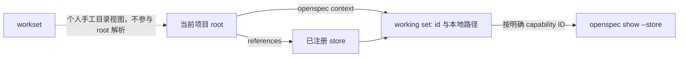

# 07 · 高级：Store（可选的跨仓库 OpenSpec 引用）

> **Store 是可选的跨仓库 OpenSpec 引用机制：声明哪些已 checkout 的 OpenSpec root 与当前项目相关，并给人或 agent 一个按需读取它们的入口。** 它不是多仓库协调层，也不是本地 main specs 变大后的默认解法；单仓库项目通常不需要它。

> **v1.7.0 root 边界。** `defaultStore` 是机器级、低优先级 fallback，不会覆盖已解析的项目 root，也不会让 referenced specs 自动内联或同步。`openspec view` 同样按 resolved root 展示，支持 `--store`。

---

## 一、为什么需要 store

先做一个反向判断：下面这些情况**不该**先来本章。

| 你遇到的问题 | 先用什么 | 为什么不是 store |
|---|---|---|
| 一个仓库的 main specs 太多，agent 不知道该读哪份 | [09](09-高级-能力身份与specs漂移维护.md) 的 taxonomy、薄 catalog、候选 path discovery | store 不会替你挑本仓库相关 capability，也不自动注入正文 |
| 一个 change 跨身份、权限、事件等多个本地 domain | proposal/design 的 impact matrix | 这是一个 repo-local change 的范围判断，不是跨仓库规划 home |
| 想让一条 change 同时修改多个 repo | 各 repo 保持自己的 change，并用明确的跨 repo 协作/PR 纪律 | store 不创建跨 repo change，不管理依赖顺序或 archive |

只有当当前 repo 的 change 确实需要**发现另一个已 checkout repo 的正式 specs**，且人/agent 需要一个工作集与按需读取入口来找到它们时，store 才有价值。



这张图也划清了边界：`references:` 只声明已知 root，`context` 只报告工作集；真正读取哪份行为合同仍由人或 agent 根据当前 change 的 scope 决定。

产品需求同时砸在 API、Web、Mobile 三个 repo 上——每个 repo 各自的 spec-driven 流程管好自己的代码没问题，但 agent 在做 API 的 change 时，如果能看一眼 Web 和 Mobile 的 specs，方案会考虑得更周全。

在 store 模型（v1.5.0）出现之前，OpenSpec 的所有操作都是 repo-local 的：

```text
my-project/
  openspec/
    specs/        ← 这个 repo 的正式规范
    changes/      ← 这个 repo 的进行中变更
    config.yaml   ← 这个 repo 的项目约束
```

store 模型给这套体系加了一层可选的能力：**让当前项目的 agent 知道还有哪些仓库的 specs 可以引用。**

## 二、store 不是什么

- **不是 monorepo** — store 不合并代码、不统一构建
- **不是 workspace 协调视图** — store 不创建新的规划 home，不管理 initiative
- **不是自动同步** — store 不 clone、不 pull、不自动更新 checkout
- **不是写操作** — store reference 只读，不会往 referenced repo 写任何东西

## 三、store 的物理结构

```text
<OpenSpec 全局数据目录>/stores/
  registry.yaml                 ← 全局 store 注册表

<store-checkout>/
  .openspec-store/
    store.yaml                  ← store 身份（id, remote）
  openspec/
    specs/                      ← store 自身的 specs（供其他项目 reference）

<OpenSpec 全局数据目录>/worksets/
  worksets.yaml                 ← 个人保存的多仓库打开视图
```

全局数据目录遵从 `XDG_DATA_HOME/openspec`；没有设置时，macOS/Linux 默认为 `~/.local/share/openspec`。它与机器级配置目录不是同一个位置，因此不应手工假定为 `~/.openspec/`。

项目通过 `openspec/config.yaml` 声明依赖：

```yaml
# openspec/config.yaml
references:
  - platform-api
  - shared-schemas
```

`openspec context` 输出当前 root 与引用 store 的工作集：已可用的本地路径、不可用引用的 clone 修复建议，以及可用 store 的按需读取命令。它**不列出或内联每份 spec，也不做相关性检索**；决定了目标 capability 后，使用输出中的 `openspec show <spec-id> --type spec --store <id>` 读取它。

## 四、核心命令

### store：注册仓库

```bash
openspec store register /path/to/checkout --id platform-api   # 注册已有 checkout
openspec store setup platform-api --path /path/to/new          # 从零创建并注册
openspec store list
openspec store unregister platform-api                         # 取消注册，保留本地文件
openspec store remove platform-api                             # 取消注册并删除本地文件夹
```

`register` 指向已有目录，不 clone、不 init；`setup` 创建新目录并同时注册。`unregister` 只忘掉注册信息，`remove` 连本地文件一起删。

### context：查看工作上下文

```bash
openspec context              # human
openspec context --json       # JSON
openspec context --code-workspace ./related-specs.code-workspace  # 写出 VS Code 多根文件
```

不带 `--code-workspace` 时，输出只是 working set：当前 root、`references:` 中声明的 store、本地路径和按需读取入口；它不列出 spec 索引，也不写文件。带该 flag 时会显式写出指定的 workspace 文件。

### workset：个人工作视图

```bash
openspec workset create my-session \
  --member app=. \
  --member platform-api=/path/to/platform-api \
  --tool code
openspec workset open my-session
openspec workset list
openspec workset remove my-session --yes
```

workset 是你手工选择的任意目录视图，不从 `references:` 推导，也不要求成员都是 store；第一个 `--member` 是主目录。它纯本地、不共享、不提交；状态在全局数据目录的 `worksets/worksets.yaml`。

### doctor：健康检查

```bash
openspec doctor
openspec store doctor platform-api
```

前者检查当前 root 的引用关系；后者检查某个已注册 store 的元数据和本地 root 健康度。

### view：先确认你到底在看哪个 root

v1.7.0 的一个容易误会点是：store 注册、项目 `references:`、机器级 `defaultStore` 都存在，但它们不是同一件事。`defaultStore` 只是本机低优先级 fallback；只要当前项目有可解析的 local planning root，它不会把该项目悄悄切到另一个 store。

```bash
openspec view                     # 按当前解析出的 root 查看
openspec view --store platform-api # 明确查看指定 store
```

当“我明明改了 config，为什么 instructions / view 看到的不是它”时，先确认 root，而不是先往 `context` 追加内容：

| 情形 | 优先相信什么 | 下一步 |
|---|---|---|
| 项目内存在 `openspec/` | 项目的 local root | 检查该 root 的 `config.yaml` / `references:` |
| 项目只是 config-only pointer 或没有 local planning shape | resolver 可能使用 store / global default | 用 `view --store <id>` 显式核对 |
| 想看其他仓库的行为合同 | 被引用 store 的 main specs | `context` 取得 store id/路径，再 `show <spec-id> --type spec --store <id>` 按需读取 |

无论最后解析到哪一个 root，store 都仍是发现与只读引用机制：它不会把远端 main specs 自动内联进本次 proposal、不会替你创建跨仓库 change，也不会替你决定哪些 capability 相关。

### `store:` pointer 的严格边界：别在错误 root 里改 guidance

`openspec/config.yaml` 里的 `store:` 不是“把本地 config 和远端 config 合并”的开关。它只有在当前 `openspec/` 是**config-only** 目录、没有 `specs/` 和 `changes/` planning shape 时，才作为 pointer 选择已注册 store。若本地已有 planning shape，本地 root 必然胜出，`store:` 会被忽略并给 warning；pointer 目录里的 `context`、`rules`、`references` 等也不会成为被选中项目的有效 guidance。

遇到“我改了 config，instructions 为什么没变化”时，先按这四步排：

1. 确定最终生效的 planning root，而不是只看当前工作目录。
2. 同一 root 同时存在 `config.yaml` 与 `config.yml` 时，确认改的是优先的 `.yaml`。
3. 用代表性 change 运行 `openspec instructions <artifact-id> --change <change> --json`，确认 context/rules 是否出现。
4. 需要 operation guidance 时，再分别检查 `instructions apply` / `instructions archive`；不要期待 artifact rules 自动进入这两个 operation。

这也是为什么 store 不适合作为“多处 guidance 拼装器”：真正的项目配置必须写在最终被解析为 planning root 的位置。

## 五、设计原则

### 5.1 上下文引用，不创建新规划层

| 做什么 | 不做什么 |
|--------|---------|
| 让 agent 看到 referenced store 的工作集、路径和按需读取入口 | 不内联 specs、不自动 merge |
| 通过 `references:` 声明依赖 | 不创建跨仓库的 change |

store 不引入新的 schema、不改变 change 的生命周期。所有 change 仍在具体 repo 下，使用 `spec-driven`。

### 5.2 单仓库不需要 store

```text
单仓库项目：
  openspec/specs/ + openspec/changes/ → 完全够用

多仓库项目：
  openspec/specs/ + openspec/changes/ + references: [other-store] → 多一层上下文
```

store 是可选扩展，不是必选项。

### 5.3 个人视图 vs 共享声明

| 类型 | 位置 | 例子 |
|------|------|------|
| 全局注册 | `<全局数据目录>/stores/registry.yaml` | store 注册（每台机器独立） |
| 项目声明 | `openspec/config.yaml` `references:` | 项目依赖哪些 store（可提交到 Git） |
| 个人视图 | `<全局数据目录>/worksets/worksets.yaml` | 多仓库打开视图（纯本地，不共享） |

## 六、与单仓库 OpenSpec 的对比

| | 单仓库 | 多仓库（store） |
|---|---|---|
| Schema | `spec-driven` | `spec-driven`（不变） |
| Change 位置 | `openspec/changes/` | 同左 |
| Specs 位置 | `openspec/specs/`（正式基线） | 同左 |
| Archive | 有 | 有（不变） |
| 跨仓库上下文 | 无 | `references:` + `openspec context` |

store 不改变核心流程——它只是在 agent 探索时多了一个「可以去看看其他仓库的 specs」的渠道。

## 七、作用范围与限制

- Workset 是纯本地的，不支持团队共享
- Store remote 是可选字段，不保证 clone 可用性
- 不提供 store 间的依赖解析

## 八、什么时候该用 store

| 场景 | 建议 |
|------|------|
| 单个仓库 | 不需要 store |
| 2-3 个关联仓库，某次 change 需要发现另一个 repo 的正式 spec | 可以注册 store + 加 references；先看索引，再按需读取 |
| 3+ 仓库且 specs 互有引用 | store 可作为跨 repo **发现索引**；每个 repo 的 change、review、archive 仍各自进行 |

不要因为“仓库多”或“spec 多”自动启用它。store 的收益来自已有 checkout 之间的明确引用；它不会减少本地 capability 的建模成本，也不会取代本章开头列出的 catalog、impact matrix 或团队协作纪律。

## 压缩结论

1. Store 是可选的跨仓库 spec **发现索引**，不是本地 spec scaling、自动 retrieval 或协调层。
2. 单仓库不需要；本地 specs 变大先用 capability taxonomy、catalog 和按需读取。
3. Store 不改 change 生命周期——所有 change 仍在具体 repo 下，用 `spec-driven`。
4. Store 不创建跨 repo change、协调视图或 initiative；它只是“注册 + 引用 + 查询”。
5. Workset 是个人本地视图，不共享。
