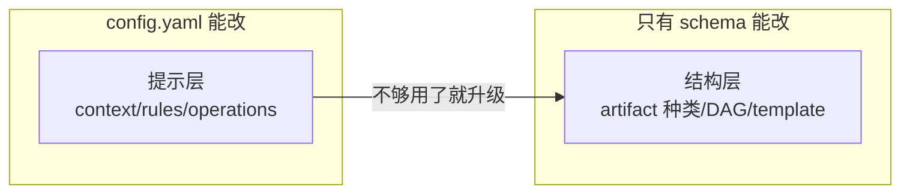
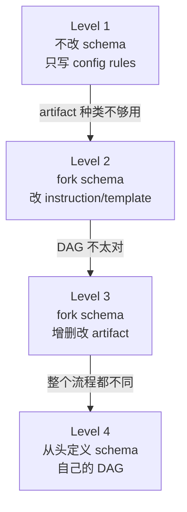

# 08 · 高级：自定义 Schema——创建自己的工作流

> 这一篇默认你已经理解了 config.yaml（[06](06-高级-config-yaml-怎么写到真正好用.md)）和 schema 的基本概念（[04](04-高级-config-schema-与项目边界.md)）。如果还没有，先回去读那两篇。

---

## 这一篇解决什么问题

写完 config.yaml 之后，你迟早会遇到一个时刻：**config 的 rules 不够用了**。

v1.7.0 先分清两种“不够”：Apply/Archive 只是需要短稳定项目步骤时，用 `operations.apply/archive.guidance`，不必 fork schema；只有想改变 artifact、依赖、template 或 apply gate/结构时，才需要自定义 schema。

不是规则写得不够好——而是你发现，你想改的东西 config 根本管不到。你想让 proposal 问不同的问题、想让 specs 换一种格式、想让 tasks 少一个阶段、甚至想把整个 artifact 流程换成你自己的。这些 config.yaml 做不到。

这时候你需要 **自定义 schema**。

---

## 一句话钉死：config 改什么，schema 改什么



| config.yaml 能做的 | 只有 schema 能做的 |
|-------------------|-------------------|
| 加 context（项目背景、约束） | 增加/删除/重命名 artifact |
| 加 rules（artifact 内容规范、禁止项） | 改变 artifact 的生成指令（instruction） |
| 加 Apply/Archive operation guidance | 定义 apply 阶段的入口条件和执行结构 |
| 指定用哪个 schema | 换掉 artifact 的输出模板（template） |
| | 重画 artifact 之间的依赖关系（DAG） |
| | 定义 apply 阶段的入口条件和执行指令 |

**一句话**：config 是在已有结构上写备注，schema 是换结构本身。

### 不要因为“项目很复杂 / 用了 agent”就立刻 fork schema

项目是传统 Web 服务、MD/Agent 控制流程，还是程序/Graph 控制流程，会影响你该在 `context` 里写哪些稳定 authority owner、在 design/specs 中记录哪些证据；**它本身不是**新建 schema 的理由。先按实际需求归位：

| 你真正想要的能力 | 先用什么 | 何时才需要 schema |
|---|---|---|
| Apply / Archive 总要收到一条短稳定项目步骤 | `operations.apply/archive.guidance` | 这条步骤必须变成新的 gate、节点或输出结构时 |
| proposal/specs/design/tasks 的写作要求不同 | `rules.<artifact-id>` 或 template 小改 | 需要新增、删除或重排 artifact 依赖时 |
| 一次 change 的分类、owner、policy、证据 | proposal 的 Context Card，再由 specs/design/tasks 具体化 | 分类必须有独立状态/审查、且现有 proposal 无法承担时 |
| 运行时不变量、权限、注册表、验证结果必须成立 | checker / test / CI / runtime contract | schema 不能替代确定性 owner |

默认 `spec-driven` 已有 proposal → specs/design → tasks 的交接链；只有 lifecycle 真正缺少 artifact、依赖、Apply gate 或输出契约时，才升级为 schema。不要在 config 中发明 `operations.explore`、`stage_context` 等字段来假装已有新阶段。

---

## 核心思维：四级递进，从"勉强用"到"自己造"

不需要一上来就自己写 schema。大多数人停在第一级就够了。关键是知道**什么时候该升级**。



### Level 1：不改 schema，只写 config rules

**什么时候够**：你用 spec-driven，proposal → specs → design → tasks 这四个阶段能覆盖你的流程。只是需要 agent 在写这些 artifact 时遵守一些领域约束。

**怎么做**：在 `config.yaml` 里加 rules。

```yaml
# openspec/config.yaml
schema: spec-driven

rules:
  proposal:
    - 每个 proposal 必须在 Impact 段标明影响的前端/后端/数据库
  design:
    - 涉及 API 变更时必须有 OpenAPI schema diff
    - 数据库迁移必须有回滚方案
```

**这一级的边界**：你改不了 proposal 问什么问题、specs 用什么格式、design 分哪些段。这些是 schema 的 template 和 instruction 定的。

### Level 2：fork schema，改 instruction 和 template

**什么时候需要**：artifact 名字和流程（proposal → specs → design → tasks）是对的，但内容不对。

举个例子——你在开发 AI Agent。spec-driven 勉强能用：proposal 写 Why/What Changes，specs 写 delta ops，design 写技术方案，tasks 拆任务。但写到 design 的时候就很别扭——你要定义的不是"用 React 还是 Vue""数据库怎么分库分表"，而是：Skill 怎么触发、Slash Command 参数怎么设计、Tool 输入输出 schema 长什么样、Evals 怎么测 agent 行为。**流程一样，填空的内容完全不同。**

再比如你在做硬件固件开发——design 里写的是中断向量表、寄存器映射、功耗预算，不是软件架构图。但 proposal → specs → design → tasks 的框架不变。

**怎么做**：fork spec-driven，只换 instruction 和 template，不改 artifact 名和 DAG。

```bash
openspec schema fork spec-driven my-domain
# 然后编辑 openspec/schemas/my-domain/schema.yaml
# 改 design 和 tasks 的 instruction——换成你这个领域真正需要的内容
# 改 design.md 和 tasks.md 的 template——换成你这个领域的章节结构
```

proposal 和 specs 通常不用大动——"为什么要做"和"spec 化要交付什么"在大多数领域是相通的。动的就是 design（"怎么设计"）和 tasks（"怎么拆任务"）——因为不同领域的"设计"和"执行"确实不一样。

**关键原则**：artifact 名不变，用户心智模型不变。不管写的是代码、agent、固件还是别的什么，proposal/specs/design/tasks 这四个动词用户已经会了。不要为了"领域感"发明新名字。

### Level 3：fork schema，增删改 artifact

**什么时候需要**：4 个 artifact 大方向对，但多了或者少了。

举个例子——你在做需求工程。你的交付物不是代码，是一份跟利益相关者反复沟通、不断打磨出来的 PRD。spec-driven 勉强能用，但 design 对你没意义——你不需要"实现方案"，那是后面开发团队的事。反过来，proposal 你需要的比 spec-driven 重得多——不只是 Why/What Changes，还要包含利益相关者分析、用户画像、原始用户故事、问答审计追踪。**4 个 artifact 里 design 是多余的，而 proposal 本身又太单薄。**

再比如你做的是一个轻量迭代流程——你觉得 proposal + specs 拆成两个 artifact 太啰嗦，一个"需求概要"就够了。那就合并。

**怎么做**：fork 一个接近的 schema，删掉不需要的 artifact、加厚需要的那几个、调整依赖关系。结果可能是 3 个 artifact，也可能是 5 个——取决于你的流程。

```text
# 需求工程的例子——去掉 design，加厚 proposal
proposal → specs → tasks → apply
```

artifact 名一个没改——用户看到 proposal/specs/tasks 就知道怎么走。只是 proposal 变重了（合并了传统 RE 的发现+获取阶段），design 没了（不需要）。

**什么时候加 artifact**：如果你的流程需要 spec-driven 没有的阶段。比如你想在 proposal 和 specs 之间加一个"用户访谈记录"，或者在 tasks 后面加一个"上线检查清单"。加 artifact 的关键规则：

- `id` 必须唯一
- `requires` 必须引用已有的 artifact id（不能引自己，不能成环）
- `template` 必须对应 `templates/` 下一个真实文件
- `generates` 定义输出文件名

### Level 4：从头定义自己的 DAG

**什么时候需要**：你的工作流和 spec-driven 的 proposal → specs → design → tasks 完全没有对应关系。artifact 种类、名字、依赖关系全部不同。

举个例子——你在协作生产一篇深度文章或文案。你的流程是：定选题和受众 → 列大纲和核心论点 → 搜集素材和事实核查 → 写初稿 → 编辑审校 → 打磨发布。这个流程跟 proposal → specs → design → tasks 完全没有对应关系——你没有"规格"，没有"实现方案"，有的是"大纲""素材""初稿""审校""发布"这些完全不同的阶段。

再比如你在做一个需要多方反复审批的合规流程——你的 artifact 可能是"申请→初审→补充材料→复审→批准"，每个阶段有不同的人参与、不同的 checklist。这和代码开发八竿子打不着。

**怎么做**：用 `openspec schema init` 起手架，或者直接手写 schema.yaml + templates/。从头定义你的 artifact 名、依赖关系、apply gate。

**这一级的代价**：用户需要学一套新的 artifact 名和流程。不要轻易走到这一级——先确认 Level 2 或 Level 3 真的不够。很多时候你觉得"完全不一样"，细看发现只是 design 的内容不对（Level 2）或者多了/少了一个 artifact（Level 3），框架本身没变。

不管走到哪一级，接下来都是同一件事：创建 schema 文件、写 template、部署、验证。下面讲怎么做。

---

## 实战：三种创建方式

| 方式 | 命令 | 什么时候用 |
|------|------|-----------|
| **fork** | `openspec schema fork <source> <name>` | 基于已有 schema 改——**推荐** |
| **init** | `openspec schema init <name>` | 从零起手架 |
| **手写** | 直接创建目录和文件 | 完全掌控，但容易写错 |

### Fork（推荐）

```bash
# 基于 spec-driven 创建一个新的
openspec schema fork spec-driven my-custom

# 生成 openspec/schemas/my-custom/
#   schema.yaml     ← 改这里
#   templates/
#     proposal.md   ← 和这里
#     spec.md
#     design.md
#     tasks.md
```

fork 之后再改 instruction 和 template——artifact 名和 DAG 默认和源 schema 一样。想改 DAG 也在这个基础改。

### Init（从零）

```bash
openspec schema init my-workflow

# 生成最小脚手架：
#   schema.yaml（一个 artifact stub + apply stub）
#   templates/tasks.md
```

适合完全不同的工作流。但需要从头定义每个 artifact。

### 手写

直接创建目录结构：

```text
openspec/schemas/<name>/
  schema.yaml
  templates/
    xxx.md
    yyy.md
```

验证：`openspec schema validate <name> --verbose`

---

## Schema.yaml 解剖

拿一个简化的工作流（去掉 design 的 3-artifact schema）来看结构。你的 schema 可能是 4 个 artifact、5 个、7 个——但骨架一样。

```yaml
name: my-workflow               # schema 名（用 --schema 时指定）
version: 1
description: 一句话说清楚这个工作流干什么

artifacts:                      # artifact 列表——定义 DAG
  - id: proposal                # 唯一 ID
    generates: proposal.md      # 输出文件名，支持 glob（如 specs/**/*.md）
    description: 这个 artifact 产出什么
    template: proposal.md       # 对应 templates/ 下的模板文件
    instruction: |              # agent 生成此 artifact 时的提示词
      在这里写你希望 agent 怎么生成 proposal.md。
      章节结构、关键原则、行为准则——都写在这里。
    requires: []                # 依赖——为空表示无依赖，是 DAG 起点

  - id: specs
    generates: "specs/**/*.md"
    template: spec.md
    instruction: |
      在这里写你希望 agent 怎么生成 spec 文档。
      每个领域不一样——代码 spec 写 delta ops，PRD 写功能需求，文章大纲写章节流。
    requires:
      - proposal                # specs 依赖 proposal 先完成

  - id: tasks
    generates: tasks.md
    template: tasks.md
    instruction: |
      在这里写你希望 agent 怎么生成任务清单。
      用 `- [ ]` checkbox 格式——apply 阶段靠这个追踪进度。
    requires:
      - proposal
      - specs                   # 多个依赖——都就绪后 tasks 才解锁

apply:                          # apply 阶段配置
  requires:                     # 至少一个 artifact 就绪才能 apply
    - specs
    - tasks
  tracks: tasks.md              # 进度追踪文件（强烈推荐 tasks.md）
  instruction: |                # apply 阶段的 agent 提示词
    写清楚执行循环和 done 标准。简短——别把方法论教科书塞进来。
```

### 每个字段的约束

| 字段 | 类型 | 必填 | 约束 |
|------|------|------|------|
| `name` | string | 是 | 唯一，用 `--schema` 时指定 |
| `version` | integer | 是 | 正整数 |
| `artifacts[].id` | string | 是 | 唯一，DAG 节点标识 |
| `artifacts[].description` | string | 是 | 对 artifact 的一句话说明 |
| `artifacts[].generates` | string | 是 | 输出文件，支持 glob（如 `specs/**/*.md`） |
| `artifacts[].template` | string | 是 | 必须对应 `templates/` 下的真实文件 |
| `artifacts[].instruction` | string | 否 | agent 生成此 artifact 时的完整提示 |
| `artifacts[].requires` | string[] | 否 | 依赖的 artifact id 列表，空 = DAG 起点 |
| `apply.requires` | string[] | 是 | 至少一个 artifact id |
| `apply.tracks` | string/null | 否 | 进度追踪文件，**强烈推荐 `tasks.md`**（偏离需自行保证 artifact `generates` 一致） |
| `apply.instruction` | string | 否 | apply 阶段的 agent 提示 |

---

## 部署与验证

### 装在哪里

| 位置 | 可见范围 | 适用场景 |
|------|---------|---------|
| `openspec/schemas/<name>/` | 当前项目 | **推荐**——团队共享、跟代码版本控制 |
| `~/.local/share/openspec/schemas/<name>/` | 当前用户所有项目 | 个人用、跨项目复用 |

```bash
# 项目级安装
cp -r schema-package/ openspec/schemas/my-schema/

# 验证
openspec schema validate my-schema --verbose
```

### 设为默认 vs 单次使用

```bash
# 单次：创建 change 时指定
openspec new change my-change --schema my-schema

# 项目默认：写入 config.yaml
# openspec/config.yaml
schema: my-schema
```

**解析优先级**：CLI `--schema` > change 的 `.openspec.yaml` > config.yaml 的 `schema` > 内置 spec-driven。

### 改了 schema 之后

不需要重建已有的 change。每次 `openspec status` 或 `openspec instructions` 即时重读 schema.yaml——改完即生效。

### 看 agent 实际收到的 prompt

```bash
openspec instructions proposal --change my-change --json
```

会输出 instruction + template + context + dependencies 拼在一起后的完整内容——调试用。

---

## 避坑清单

### 1. `apply.tracks` 强烈推荐用 `tasks.md`

进度计数通过 `schema.artifacts` 中 `generates` 匹配 `apply.tracks` 的文件名来找到对应的 artifact，所以技术上你可以用自定义名字（比如 `checklist.md`）——前提是存在一个 `generates: checklist.md` 的 artifact。但默认脚手架和工作流模板都默认 `tasks.md`，fallback 路径按 `id === 'tasks'` 查找 artifact，**偏离它意味着你需要自己保证所有环节一致**，否则计数、apply 指令、以及 archive 行为都可能出错。除非有明确理由，否则不要换名字。

### 2. 改 artifact id 要同步改 config.yaml 的 rules key

config.yaml 的 rules 是按 artifact id 做 key 的：

```yaml
rules:
  proposal:           # ← 这个 key 必须和 schema 里的 artifact id 一致
    - 每个 proposal 必须...
```

如果你在 schema 里把 `proposal` 改成了 `brief`，config.yaml 里也要改成 `brief`——否则那条 rule 永远不会生效。

### 3. 每次改完 schema.yaml 先 validate

```bash
openspec schema validate my-schema --verbose
```

常见报错：

| 报错 | 原因 | 修法 |
|------|------|------|
| `Duplicate artifact id` | 两个 artifact 同名 | 改其中一个 id |
| `Unknown artifact id in requires` | requires 引用了不存在的 id | 检查拼写或补上缺失的 artifact |
| `Cyclic dependency detected` | requires 关系成环 | 画 DAG，砍掉一条边 |
| `Template file not found` | template 字段指定的文件不存在 | 在 templates/ 下创建文件，或改 template 字段 |

### 4. 不要改内置 schema

直接改 `node_modules` 里的 spec-driven 会在下次安装时被覆盖。用 fork。

### 5. artifact 名和 DAG 尽量对齐 spec-driven

这是最容易被低估的原则。spec-driven 的 proposal → specs → design → tasks 是一套用户已经学会的心智模型。如果你的领域只是内容不同（Level 2），不要换名字——换了名字用户就要重新学。只有当你确认结构真的不同（Level 4），才发明新 artifact。

### 6. apply.instruction 保持简短

```yaml
# ❌ 太长——把沟通方法论、审查 checklist、质量标准全塞进 YAML
apply:
  instruction: |
    你现在进入执行阶段。你的角色是需求工程推动者……
    ## 执行循环
    对每个未完成任务：1) 读取文档 2) 完成任务 3) 标记 [x] 4) 有返工就加新任务
    ## 沟通
    - 有疑问时提问，有把握时确认
    - 帮助利益相关者想得更深
    - 知道何时坚持、何时让步
    ## 审查
    - [ ] 所有用户故事有对应需求
    - [ ] 所有需求有可测试验收标准
    - [ ] 错误/边界/空数据覆盖
    - [ ] 无矛盾、无歧义、无隐含假设
    ## 迭代
    - 阶段宽松，交付物严格
    - 审查发现缺口就回去补
    ## 质量判断
    足够好标准：1) Must 有验收标准 2) 边界覆盖 3) 无矛盾 4) 开发团队能估算 5) 利益相关者确认
    ## 签收
    1) 填 Approval 2) 记权衡 3) 有拒签记条件
    ## 交接
    补齐 Handoff Notes：复杂度、集成点、建议顺序、已知未知、联系人
    （……总共 80+ 行）

# ✅ 简短——只写执行循环和 done 标准
apply:
  instruction: |
    Execute the workflow using the checklist:
    1) read inputs before making changes
    2) complete tasks in priority order, mark [x] as you go
    3) when a task needs stakeholder input, ask — don't assume
    4) if review finds gaps, update artifacts and re-review

    Definition of done:
    - all tasks checked
    - stakeholder confirms
```

agent 不需要你在 instruction 里教它怎么沟通、怎么审查——它自己会。instruction 只写**这个 schema 特有的执行规则**，通用方法论留给 agent 自己判断。

---

## 压缩结论

- **config 改提示层，schema 改结构层**——只有 schema 能改 artifact 种类、DAG、template、apply gate
- **四级递进**：不改 schema（写 rules）→ fork 改内容（换 instruction/template）→ fork 改结构（增删 artifact）→ 从头定义（自己的 DAG）
- **artifact 名尽量对齐 spec-driven**——proposal/specs/design/tasks 这套动词用户已经会了，不要为了"领域感"发明新名字。除非你的流程真的装不进这个框架
- **fork 优先**——比 init 和手写快，而且继承了源 schema 的验证过的 DAG
- **装项目级、验证完再用**——`openspec/schemas/<name>/` + `openspec schema validate <name> --verbose`
- **`apply.tracks` 强烈推荐 `tasks.md`**——默认脚手架和模板都用它；如果换成自定义文件名，确保有 `generates` 匹配的 artifact，且 fallback（按 `id === 'tasks'` 查找）能正确回退
- **改 artifact id 记得同步 config.yaml 的 rules key**——key 耦合，不同步 rule 静默失效
- **apply.instruction 保持简短**——只写执行循环和 done 标准，方法论留给 agent

---
