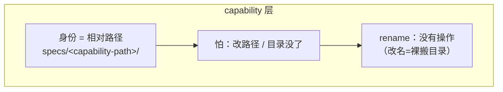
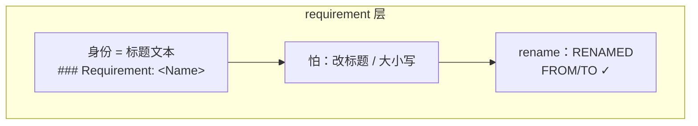

# 09 · 高级：Capability 规划、身份与 specs 漂移维护

> **适用 OpenSpec v1.7.0** · 高级篇。这一章按四层递进回答一个问题：**什么行为值得成为独立 capability？** → **specs 靠什么组织和定位？** → **增长后如何让 agent 只读需要的合同？** → **用久了为什么会漂、怎么治理？**

## 先回答：为什么这事值得你操心

很多人把 specs 当"写一次、archive 了就完"的产物，觉得维护是可有可无的额外负担。**这是个误解，而且代价不小。** `openspec/specs/` 是整套 spec-driven 机制的**事实层契约**——人和团队靠它理解"项目现在是什么"，coding agent 更是直接把它当成**现状的地面**来读。它一旦和代码对不上，后果不是"文档有点旧"这种无害小事，而是地基松动：后面所有基于它的工作，都会从错误的前提出发。

漂移一旦发生，对后续工作的影响是**具体、且越拖越被动**的：

| 漂在哪 | 后面会发生什么 |
|---|---|
| spec 说"有"、代码早没了（冻结）| agent 拿过时前提去 propose / apply → 产出错误或要返工的代码；写出去的 delta 一 archive 还可能 `not found`、整批回滚 |
| 代码新上了、spec 没记（漏报）| agent 在 specs 里找不到这块 capability 的契约 → 只能瞎猜或被迫读源码，行为不可预测、质量打折 |
| 标题或目录名被改、没走 RENAMED | 历史 delta 和当前 spec 全对不上 → 下一次正常的 archive 直接 `not found`、**整次 archive 原子中止**，工作卡在半路（本 repo 的 `simplify-skill-installation` 就是 16 条目标全 `not found`，连本该成功的部分也一并没落地）|
| 废弃的 change 还挂在 active | agent 以为有一堆"进行中方向"，被假信号带偏，优先级和判断全乱 |

更要命的是**漂移会复利**：脏的 specs 让 agent 产出更不准的 change，archive 回去又把更不准的"事实"焊进真相——一轮比一轮偏。等 `source of truth` 不再 true，spec-driven 那套"spec 先行、增量演化"的前提就塌了：agent 越干活、specs 越脏，你却**没有任何工具会告诉你偏了**（`validate` 只查文件结构，从不打开主 spec 去比对）。

所以维护 specs 不是文档洁癖，而是**保住这套机制本身能成立的地基**。带着这个认知往下读，"specs 按什么组织、为什么会漂"就不再是冷知识——它直接告诉你地基为什么这么脆、你又该怎么守。

## 先看清：spec-driven 是背后的 driver

前面几章你会反复看到 `config.yaml` 里写着 `schema: spec-driven`。它不是个可以略过的配置细节——**`spec-driven` 是 OpenSpec 默认、最常见的工作流 schema，也是背后的 driver。**

`schemas/spec-driven/schema.yaml` 这个文件定义了**每个 change 的骨架和契约**：

- artifact 依赖图：`proposal → {specs, design} → tasks → apply`；在 `skip_specs: true` 的纯重构、工具或文档 change 中，specs artifact 会显式跳过；
- delta 操作：`## ADDED / MODIFIED / REMOVED / RENAMED Requirements`；
- 格式规则：每个 requirement 用 `### Requirement: <name>`、每个 scenario **必须** `#### Scenario:`（4 个 `#`，少了静默失败）、requirement 正文要含 `SHALL`/`MUST`；
- **capability 契约**：有 spec-level 行为改动时，proposal 列出的每个 capability 都应有对应的 `specs/<path>/spec.md`；`skip_specs: true` 只适用于没有此类改动的 change，且不能与 delta specs 共存。

关键一句（schema 原文）：

> The Capabilities section is critical. It creates the **contract between proposal and specs phases**. … Each capability listed here will need a corresponding spec file.

**为什么这点重要**：你写进 `openspec/` 的任何东西，都得符合这个 schema 的契约——CLI 和 agent 是照着它解析的。**偏离契约（4 个 `#` 写成 3 个、capability 名拼错、缺 SHALL/MUST），工具要么静默忽略、要么 parse 失败，agent 就在残缺/错误的前提上推理，产生幻觉、行为混乱。**

下面要讲的"capability 身份"，就是这个契约里最核心、又最容易被忽略的一条。

**capability 契约在 schema.yaml 中的样子**——正常行为 change 的 proposal 宣布 capability，specs 阶段产出同路径 `specs/<capability-path>/spec.md`；纯非 spec change 则显式声明 `skip_specs: true`（简化自 `schemas/spec-driven/schema.yaml`）：

```yaml
# schemas/spec-driven/schema.yaml（节选）
artifacts:
  - id: specs
    requires: [proposal]
    # ↑ proposal Capabilities 节列出的每个 path → specs/<path>/spec.md
    # 相对路径即身份——同路径才命中，改名即失配
```

## capability 的身份 = 它的相对路径

很多人把 `openspec/specs/` 笼统当成"spec 基线"。但它不是一堆平铺的文档：v1.7.0 会递归发现任意深度的 `spec.md`，并按 capability 切分目录：

```text
openspec/specs/
├── auth/spec.md                    ← ID = "auth"
├── identity/
│   ├── login/spec.md               ← ID = "identity/login"
│   └── session/spec.md             ← ID = "identity/session"
└── data-export/spec.md
```

**一个 capability 的身份，就是它在 `specs/` 下的相对目录路径**（`auth`、`identity/session`）。路径同时承担四个角色：

| 角色 | 说明 |
|------|------|
| **组织单位** | main specs = 一组 `specs/<capability-path>/spec.md`，按行为合同切分管理 |
| **proposal↔specs 的契约** | proposal 列的每个 capability path，specs 阶段生成同路径 `specs/<path>/spec.md`；默认文案仍偏 flat，团队采用 nested layout 时应明确约定 |
| **delta 的靶心** | delta 写在 `changes/<id>/specs/<path>/spec.md`，archive 时打 `openspec/specs/<path>/spec.md`——**相对路径相同才命中** |
| **没有别的身份** | capability **没有稳定 ID**，就靠这个相对路径维系 |

目录层次只是一种命名空间，不带父子继承、自动聚合或依赖推导；`identity` 和 `identity/session` 是两个独立 capability。archive 能把 delta 合并进主 spec，靠的就是**相对路径寻址**——不是魔法，是契约。这也意味着：**改一个 capability path，是个大事**（见下文）。

## 先把 capability 切对：它是行为合同，不是代码文件夹

一个 capability 最实用的定义是：**它能独立说明用途、独立承受行为变化，并由一组 requirements/scenarios 独立验证。** 这一定义故意不按源文件、数据库表、页面或团队分工来切——一份真正的行为合同经常横跨这些实现层。

| 候选切法 | 应问的问题 | 判断 |
|---|---|---|
| 按 UI 页面或 `src/` 目录 | 这个实现位置改变时，用户合同一定独立吗？ | 通常不是；别把实现结构直接当 taxonomy |
| 一个新的用户/调用方行为 | 它能否有自己的场景、失败路径和演进节奏？ | 是，适合独立 capability |
| 两组 requirement | 它们是否总要同改、同测、同读才能解释？ | 是，先留在同一 capability，别为树形漂亮而碎片化 |
| 新 adapter、换库、纯重构 | 可观察行为是否没有变？ | 通常不是新 capability；必要时用 `skip_specs: true` |

推荐从**一层 domain + 一层 capability**开始：

```text
identity/login
identity/session
billing/invoices
data-export
```

只有第三层本身也长期稳定、并能帮助未来读者导航时才继续加深，例如 `platform/observability/audit-events`。segment 用语义明确的 kebab-case；避免 `common`、`misc`、`utils`、`core` 这类“边界没想清楚”的垃圾桶名。domain 只承担命名和 discovery，不是父合同。

在建新 path 前，先搜索既有 path、Purpose 和 requirement 标题。能修改已有行为合同，就不要创建近义 capability；只有确有独立合同与独立演进节奏时才新建。新 capability 的 delta 请写可读的 `## Purpose`，v1.7.0 在 archive 创建 main spec 时会把它带入，而不是一律写成 `TBD`。

## specs 很多以后：catalog 帮你找，main spec 才能定

recursive discovery 让 OpenSpec 能识别任意深度的 `spec.md`，却**不会**自动完成“找相关 spec → 读够上下文 → 记录选择理由”这条链。不要把所有 main specs 塞进 prompt，也不要把完整 requirements 复制到 `config.context`。

项目可在 `openspec/specs/README.md` 或独立文档保留一张薄 catalog：

```markdown
| path | Purpose | keywords | boundary / neighbor |
|---|---|---|---|
| identity/session | 建立、刷新、失效用户会话 | JWT, refresh, expiry | 不负责授权策略；相邻 identity/login |
| billing/invoices | 创建、投递、查询发票 | invoice, tax, PDF | 不负责订阅扣款 |
```

catalog 只能导航，不能成为第二份行为规范；任何冲突都以 main spec 为准。一个局部 change 的最小 discovery 协议是：

1. 先读短小项目 context，知道全局不能破坏什么。
2. 读 catalog 或运行 `openspec list --specs --json`，列出候选 path，而不是把正文全读进来。
3. 用用户意图、关键术语和代码调查缩小候选；在 proposal 中标记每个 path 是 New、Modified、verify only 还是排除，并写一句理由。
4. 用 `openspec show <path> --type spec --json --requirements` 先看 requirement 标题；只有要 MODIFIED/REMOVED/RENAMED 时才读完整 block 与 scenarios。
5. delta 使用 proposal 中声明的**同一完整相对 path**；不确定边界就回 Explore，不要临时发明近义名称。

这是一条项目治理协议，而非 v1.7.0 已自动保证的 retrieval 功能。把 path convention、catalog 位置和这几个步骤写进项目 `AGENTS.md` 或 `rules.proposal`；只把跨所有 change 都成立的短原则留在 config。详细模板见 [`_digested/spec-driven-capability/capability-governance-template.md`](../_digested/spec-driven-capability/capability-governance-template.md)。

## 两层「以名字为身份」模型（无稳定 ID）

OpenSpec 的身份模型是**「以名字为身份」（name-as-identity），分两层，都没有稳定 ID**：

| 层 | 身份 = | 怕什么 | 有没有 rename 操作 |
|----|--------|--------|-------------------|
| **capability** | **相对路径**（`specs/<capability-path>/`，例如 `identity/session`） | 改路径 / 目录没了 | **没有** |
| **requirement** | **标题文本**（`### Requirement: <Name>`） | 改标题 / 大小写 | 有（`## RENAMED Requirements`，FROM/TO） |




两个推论，直接关系到 specs 会不会漂：

1. **都怕改名，且没有 ID 兜底。** 传统系统里改个名字，ID 不变，引用不断链。OpenSpec **没有 ID**——名字一改，所有指向旧名字的引用全部失配，而且**没有任何工具告诉你断了**。
2. **capability 比 requirement 更脆。** requirement 至少有 `RENAMED` 操作（`FROM: ### Requirement: 旧` / `TO: ### Requirement: 新`），改名是个一等动作；**capability 没有任何 rename 操作**——改 capability path 只能靠你手动搬目录，然后所有指向旧路径的 delta 默默变成"悬空目标"。

> 一句话：**requirement 改名有“正规手续”（RENAMED）；capability 改名没有手续，是裸操作。** 所以完整 capability 相对 path 要当**稳定性契约**对待——能不改就不改。

## 这就是 specs 漂移的根源

`openspec/specs/` 号称 source of truth，但用着用着就和代码对不上了。根因就是上面这套身份模型 + 一个事实：**没有任何工具持续对账**（`validate` 只查文件结构、从不打开主 spec 去比对，`archive` 只在那一刻匹配一次）。

漂移，就是**两层"名字身份"失配**：

- **capability 层失配**：delta 指向的 capability 相对路径，在 `openspec/specs/` 里对不上——要么"设计了没建"、要么"路径改名了"、要么"早删了"。**表现：archive 一个 change 时，目标 spec 不存在或对不上；或一堆 change 悬空挂在 active。**
- **requirement 层失配**：delta 的 `MODIFIED`/`REMOVED` 指向的标题，在当前主 spec 里找不到——标题被别的 archive 改写过、大小写变了、或手改过。**表现：archive 报 `... not found`，整批原子回滚。**

两层是**同一个病**（名字身份失配），只是发生在不同层。再加上"有代码无 spec"（反向漂移：capability 上线了 specs 没记）、"废弃 change 仍挂 active"（噪声）等，specs 就慢慢配不上"source of truth"这个名号了——而 agent 还把它当事实读，于是被带偏。

## 平时怎么守住（handbook 通俗版）

不必背一堆手段，记住几条就够：

- **做完一个 change 就 `archive`，别让它卡在 active 状态。** specs 只在 archive 那一刻更新；不 archive，specs 永远停在旧版本。
- **requirement 改名走 `RENAMED`**，别"删旧 + 加新"（那会掐断历史，让老 delta 失配）。
- **capability path 尽量别改。** 没有正规 rename 操作，改路径=裸搬目录，要同步所有引用它的 delta——当稳定性契约对待。
- **apply 改代码时，顺手想一句"这段 spec 还准吗"。** 这是最廉价的对齐动作。
- **偶尔巡检**：`openspec list` / `openspec validate --all` 能抓结构坏死（僵尸 change）；但**别把"validate 干净"当成"specs 对齐"**——它查不出 capability/requirement 的名字失配和 specs↔代码漂移。
- **别手改主 spec 文件**。要改就写 change（delta）再 archive；手改没有任何工具追踪，下次 delta 一撞就 `not found`。

## 真要拆分、合并或改 path：把它当成 rebaseline，不是普通 archive

requirement 有 `RENAMED` 操作，capability 没有。把 `auth` 改为 `identity/login`、将一个大 spec 拆成两个 path、或合并两个 path，都会改变 capability ID；archive 只会看到旧 ID 和新 ID，不会自动迁移 active delta、catalog、文档或调用方约定。

因此结构变化必须单开一项受控 rebaseline。最小顺序是：

1. 写出旧 path → 新 path 的映射，以及每个 requirement 最终归属和迁移理由。
2. 列出所有触及旧/新 path 的 active changes；完成、取消、冻结或逐个重基线，不能让它们继续指向旧地址。
3. 以当前 main specs 为共同基线，人工审阅后移动或重建 main spec；不要仅靠历史 delta 猜内容。
4. 同步更新仍需保留的 active delta、catalog、AGENTS/config 约定、文档链接和外部引用。
5. 用 `openspec list --specs --json` 核对 identity；对 main specs 与每个受影响 change 做 strict validation；最后人工 review 后再恢复正常 archive。

```bash
openspec list --specs --json
openspec validate --specs --strict
openspec validate <affected-change> --type change --strict
```

同样地，两个 active changes 同时改同一 capability path 时，后 archive 的 change 必须基于前一个 archive 后的 main spec 重新核对 requirement block。可完全一致的 early sync 在 v1.7.0 可以成为 no-op，但它不是用来绕过并发协调、review 或结构迁移的捷径。

### 一个够用的维护节奏

| 时机 | 至少检查什么 |
|---|---|
| 每个 proposal | 查过 catalog/既有 path；New 或 Modified 有理由；近义 capability 已排除 |
| 每个 archive | delta path 与 main path 一致；新 capability 有可读 Purpose；没有遗留 active change 指向旧 path |
| 跨 domain change | 用 impact matrix 说明哪些 path 修改、仅验证或明确排除 |
| 定期巡检 | 是否有过粗 spec、同义 path、`TBD` Purpose、失效 catalog 条目或长期 active delta |
| taxonomy 重构前 | rebaseline 计划、active-change inventory、迁移验证与明确 owner |

## 压缩结论

1. capability 是可独立演化、验证的行为合同；domain 只是浅 taxonomy 的导航名称。
2. path 是 capability 的稳定身份；proposal、delta、archive 必须使用同一完整相对 path。
3. catalog 只帮你缩小阅读范围，main spec 才是行为真相；nested path 不会自动 retrieval。
4. requirement 改名有 RENAMED，capability 改 path 没有正规操作；拆分、合并、移动必须做受控 rebaseline。
5. 漂移会复利，且 validate 只查结构；每次 proposal/archive 都应留下最小 discovery 与对齐证据。
