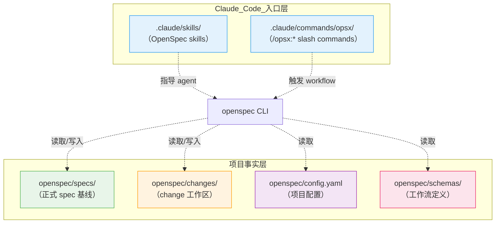
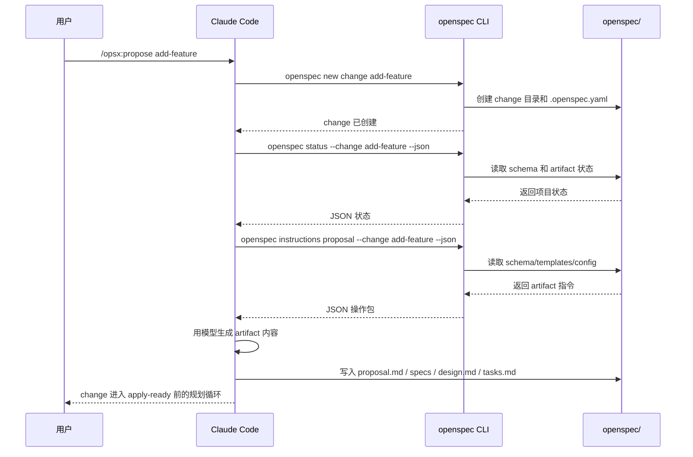

# 10 · 实战：Claude Code 里的 OpenSpec 到底怎么落地

> 这一篇回答的是"放进 Claude Code 以后，它到底长什么样"。

---

## 先把最容易想错的地方说透

很多人第一次看，会误以为：

- `.claude/skills/` 里的 skill 文件就是 OpenSpec 本体
- `.claude/commands/` 里的 slash command 才是核心
- `config.yaml` 是能控制一切的总控中心

其实都不对。

放进 Claude Code 后，OpenSpec 仍然有两层：

1. **项目事实层**
2. **Claude Code 入口层**

### 新手最常问：为什么需要两层？直接一层不行吗？

**答案：为了让 OpenSpec 不被绑死在某个 agent 工具上。**

如果只有一层（比如全放 `.claude/`），会有什么问题：

| 问题 | 后果 |
|------|------|
| 换工具就要重写所有项目事实 | 从 Claude Code 换到 Codex 或 Cursor，specs/ 也要迁移 |
| 项目事实和工具入口混在一起 | 看不清哪些是项目长期资产，哪些只是给 agent 看的入口 |
| 多个工具无法共存 | Claude Code、Cursor、Codex 不能共享同一套 OpenSpec 状态 |

**两层设计的好处**：

```text
项目事实层（openspec/）
  ↓ 被多个工具共享
工具入口层（.claude/ 或 .agents/ 或 .cursor/）
```

- 项目事实（specs/changes/config.yaml/schemas）只写一次
- 不同工具各自有自己的入口层
- 换工具时，重新投递 skills/commands 即可，项目事实不变

---

## 第一层：项目事实层

这层在项目自己的 `openspec/` 目录里。

```text
openspec/
├── specs/
├── changes/
├── config.yaml
└── schemas/
```

这层管的是：

- 项目当前正式 spec 基线
- 进行中的 change 和它的 artifacts
- 项目级背景与规则
- change 结构定义，也就是 schema

这层才是 OpenSpec 的核心数据层。

---

## 第二层：Claude Code 入口层

这层在 `.claude/` 目录里。

通常你会看到：

```text
.claude/
├── skills/
│   ├── openspec-propose/
│   │   └── SKILL.md
│   ├── openspec-explore/
│   │   └── SKILL.md
│   ├── openspec-apply-change/
│   │   └── SKILL.md
│   ├── openspec-sync-specs/
│   │   └── SKILL.md
│   └── openspec-archive-change/
│       └── SKILL.md
└── commands/
    └── opsx/
        ├── propose.md
        ├── explore.md
        ├── apply.md
        ├── sync.md
        └── archive.md
```

这层不是项目事实层，而是"让 Claude Code 知道怎么触发 OpenSpec workflow"。

所以更准确的理解是：

- `openspec/` 保存事实
- `.claude/skills/` 保存 agent 可发现的 workflow 说明
- `.claude/commands/opsx/` 保存用户可触发的 slash command 入口

这里的 `opsx` 只是 OpenSpec 在 Claude Code 里的命令命名空间。它不是一套独立于 OpenSpec 的系统，也不是另一个 CLI；`/opsx:propose` 这样的入口最终仍然围绕 `openspec` CLI 和 `openspec/` 文件状态工作。

### 这层怎么生成

初始化时可以显式选择 Claude Code：

```bash
openspec init --tools claude
```

之后如果 OpenSpec 的 workflow 模板、profile 或 delivery 选项发生变化，用：

```bash
openspec update
```

刷新 Claude Code 入口层。

v1.10.0 的结束提示按**本次实际生成的 surface**判断：只有某个需要 IDE reload 的工具确实收到新 commands/skills，CLI 才打印 `Restart your IDE ...`。Claude Code 这类 CLI 宿主通常直接读取刷新后的文件，不会因为和某个 IDE 工具同时配置就被笼统要求重启；如果 update 没打印重启提示，就不要把重启当固定步骤。

> **模型切换是 Claude Code 层的事，不影响 OpenSpec。** OpenSpec 的 `status`、`instructions`、schema、artifacts 都不因换模型而变。需要切模型时，在 Claude Code 的 settings 或启动环境里配置 endpoint/key/model，结束后恢复原配置即可——不要把 API key 写进项目文件。

---

## 一个典型项目长什么样

```text
my-app/
├── src/
├── tests/
├── openspec/
│   ├── specs/
│   ├── changes/
│   ├── config.yaml
│   └── schemas/
└── .claude/
    ├── skills/
    └── commands/
        └── opsx/
```

如果要一句话概括：

> **OpenSpec 的"内容"在 `openspec/`，OpenSpec 的"入口"在 `.claude/`。**

### 两层架构可视化



---

## Claude Code 里一次命令背后发生什么

以 `/opsx:propose` 为例，可以粗略理解成 4 步：



所以 Claude Code 本身不是 OpenSpec。
它只是 OpenSpec 被人触发、被模型读取的宿主环境之一。

同样，`/opsx:propose` 也不是 `openspec propose` 的别名。OpenSpec CLI 里没有一个单独的 `propose` 子命令；Claude Code 触发 `/opsx:propose` 后，会按照 skill/command 里的 workflow 说明调用 `openspec new change`、`openspec status`、`openspec instructions` 等 CLI 能力。然后由 Claude Code 读项目代码、生成 Markdown artifacts、写回 `openspec/changes/`。

---

## skill 和 command 在 Claude Code 里分别做什么

Claude Code 下通常会同时投递 skills 和 commands。

| 层 | 例子 | 作用 |
|---|---|---|
| skill | `.claude/skills/openspec-propose/SKILL.md` | 告诉 Claude Code：什么时候该使用这个 OpenSpec workflow，以及执行步骤是什么 |
| command | `.claude/commands/opsx/propose.md` | 给用户一个 `/opsx:propose` 入口 |
| CLI | `openspec status --json`、`openspec instructions ... --json` | 返回真实状态、路径、依赖、模板、context/rules |
| 文件系统 | `openspec/specs/`、`openspec/changes/` | 保存项目事实和 change 状态 |

一个容易混淆的地方是：skill/command 里确实有很多说明文字，但它们不是事实源。真正的状态来自 `openspec/`，真正的运行时解释来自 CLI。

因此看到 `.claude/commands/opsx/` 时，应该读成：

```text
Claude Code 里的 OpenSpec 命令入口
```

而不是：

```text
一个叫 OPSX 的独立工具
```

---

## 人类最该关心的，不是机器细节，而是层次别搞混

如果你是人类使用者，最值得记住的只有三点：

### 1. Claude Code 是入口，不是事实来源

不要把 `.claude/skills/...` 或 `.claude/commands/...` 当成项目能力定义。

### 2. `openspec/specs/` 才是长期基线

项目当前能力的正式表述，最终沉淀在这里。

### 3. `openspec/changes/` 是 change 工作区

平时迭代都发生在这里，archive 后再合并回基线。

---

## 什么时候才需要继续看机器视角

只有当你想研究这些问题时，才需要再往下看：

- Claude Code 具体调用了哪些 CLI
- `instructions --json` 里有什么
- skill、command、workflow 三者如何对应

这时再去看 [`90` 附录](90-附录-给机器看的-agent-协议.md)。

---
