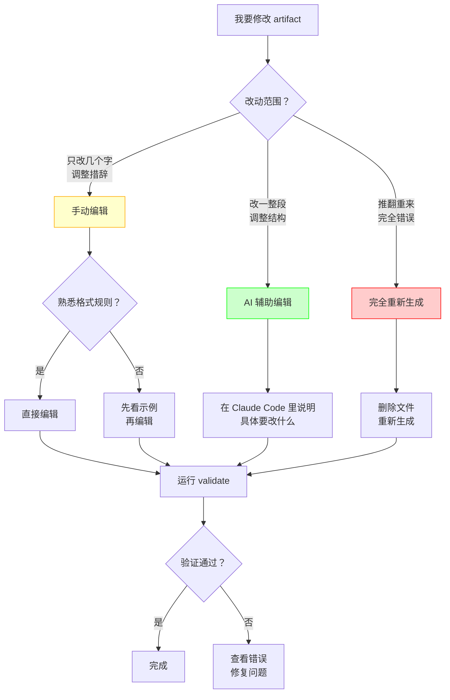

# 12 · 实战：如何正确修改 Artifacts

> 这一篇解决新手最困惑的问题：**OpenSpec 的 artifacts 到底该怎么改？** 和别的 SDD 工具不同，OpenSpec 是**弱约束**——artifacts 归你所有，可以手改、可以让 AI 重写、改完跑 `validate`。本文教你在这个自由度下，按文件类型安全地改、不踩格式坑。core profile 是默认前提，见下方专节。

---

## 重要前提：Profile 说明

OpenSpec 有两种 profile（配置模式）：

这里列出的 `/opsx:*` 是 Claude 的 OpenSpec workflow command，不是另一套叫 OPSX 的独立工具。终端里的底层 CLI 仍然是 `openspec ...`；Codex 使用 `$openspec-*` skills。下文命令表要按宿主 adapter 理解，不能把 slash 语法推广到所有工具。

> **artifact 边界。** specs 可以是嵌套 capability path；`skip_specs: true` 是没有 spec-level 行为变化时的 metadata。每条 task 自带 verification；capability 退役若仍有未归属内容会被阻止。delta 解析接受全部 CommonMark 列表标记、重复 section header 全部生效、code fence 内空行保真、rename 保序。配置方面，artifact `rules` 只影响 artifact 生成，Apply/Archive 读 project `context` 与对应 operation guidance。

| Profile | 命令数量 | 适用场景 | 是否默认 |
|---------|---------|---------|---------|
| **core** | 6 个命令 | 快速开发，简单场景 | 是（默认） |
| **custom** | 12 个命令 | 复杂项目，需要更多控制 | 否 |

### 检查你当前的 Profile

```bash
# 查看当前 profile
openspec config profile

# 输出示例
# profile: core
```

### Core Profile 的 6 个命令

```bash
/opsx:propose <name>   # 创建 change + 生成所有 artifacts
/opsx:explore          # 探索/调研模式
/opsx:apply [name]     # 实现 tasks
/opsx:update           # 更新现有 artifact（core）
/opsx:sync             # 同步 delta specs（core）
/opsx:archive [name]   # 归档 change
```

### Custom Profile 的额外命令

```bash
/opsx:new <name>       # 只创建 change 目录
/opsx:continue         # 逐个生成 artifact
/opsx:ff               # 快速生成所有 artifacts
/opsx:verify           # 验证实现与 specs 一致性
/opsx:bulk-archive     # 批量归档
/opsx:onboard          # 新成员快速了解项目
```

### 如何切换到 Custom Profile

```bash
# 步骤 1：切换 profile
openspec config profile
# 选择 "custom" 或输入你想启用的 workflows

# 步骤 2：更新 AI 工具的 skills
openspec update

# 步骤 3：只在 update 实际刷新了 IDE 驻留的 commands/skills 且 CLI 给出提示时重启
```

`openspec update` 的重启提示是条件性的：Cursor、Cline 等 IDE 驻留 surface 实际生成了新 commands/skills 时才提示；Claude Code、Codex、OpenCode 等 CLI-only 工具通常会立即读文件，不应笼统要求重启所有 AI 工具。

### 本文档的假设

**本文档中的某些示例使用 custom profile 的命令**（如 `/opsx:continue`）。

如果你使用 **core profile**（默认），请参考每个场景下的"Core Profile 替代方案"。

## 改 spec 前的第一步：先定位 capability path，再动 requirement

手改 artifact 的最大风险不只是少写一个 `#`，还包括“改对了文字、改错了合同”。spec-driven 把 capability 的完整相对 path 当 identity：`changes/<change>/specs/<path>/spec.md` 只会同步到 `openspec/specs/<path>/spec.md`。

因此每次准备修改 specs 时，先按这个顺序：

```bash
openspec list --specs --json
openspec show <candidate-path> --type spec --json --requirements
openspec show <candidate-path> --type spec --json --requirement <n>
```

先列候选 path，查看 requirement 标题；只有要 `MODIFIED`、`REMOVED` 或 `RENAMED` 时才读取完整 block 与 scenarios。不要因为“页面上有一个导出按钮”就新建 `export-button` path：先判断它是已有合同的修改，还是有独立行为、场景和演进节奏的新 capability。

| 这次实际变化 | 应编辑什么 |
|---|---|
| 已有 capability 的可观察行为改变 | 同 path 下的 delta，`MODIFIED`/`ADDED` 等操作写完整 requirement contract |
| 新的独立行为合同 | 新 path 的 delta，并写可读 `## Purpose` |
| 纯重构、换实现、工具/文档工作 | `.openspec.yaml` 的 `skip_specs: true`，且移除所有 delta spec 文件 |
| 要拆分、合并或移动 capability path | 停止把它当普通 artifact 编辑；做受控 rebaseline，先处理 active changes |

目录层次不提供继承或自动 retrieval；catalog 只能帮助你找到 path，main spec 才是行为真相。完整规划方法见 [09](09-高级-能力身份与specs漂移维护.md)。

---

## 为什么需要这一篇

如果你已经读过前面的文档，会用 `/opsx:propose`、`/opsx:apply`、`/opsx:archive`，但可能还有这些困惑：

| 困惑 | 典型问题 |
|------|---------|
| **config.yaml 怎么改？** | 手改怕破坏格式，但没有"推荐修改方式" |
| **proposal.md 怎么改？** | 直接手改？还是让 AI 重新生成？ |
| **specs 有问题怎么调整？** | 改了会不会破坏 delta spec 格式？ |
| **design.md 怎么调整？** | 实现过程中发现设计不对，怎么办？ |
| **tasks.md 怎么调整？** | 任务拆分不合理，怎么改？ |
| **.openspec.yaml 怎么调整？** | 这个文件是干什么的？能改吗？ |

这一篇重点展开最常改、也最容易改坏的两类文件：`config.yaml` 和 `proposal.md`。后面的 specs/design/tasks/.openspec.yaml 会给出安全修改原则，避免把本文变成逐字段手册。

---

## 修改 Artifacts 的三种方式

在开始具体讲解之前，先理解修改 artifacts 的三种基本方式：

### 方式对比表

| 方式 | 适用场景 | 优点 | 缺点 | 风险等级 |
|------|---------|------|------|---------|
| **手动编辑** | 小改动、微调措辞、添加细节 | 快速、精确、保留上下文 | 可能破坏格式、需要熟悉规则 | 中等 |
| **AI 辅助编辑** | 中等改动、调整结构、重写某段 | 平衡灵活性和安全性 | 需要明确指令 | 低 |
| **完全重新生成** | 大改动、推翻重来、格式完全错误 | 保证格式正确、省心 | 丢失之前的手动修改 | 高 |

### 决策树：我该用哪种方式？



### 三种方式的详细说明

#### 方式 1：手动编辑

**什么时候用**：
- 修改几个字、调整措辞
- 添加一个新的 requirement 或 scenario
- 修改 Out of Scope
- 调整任务顺序

**优点**：
- 最快速
- 保留所有上下文
- 精确控制

**缺点**：
- 可能破坏格式（如果不熟悉规则）
- 需要手动保持一致性

**示例场景**：
```markdown
# 场景：proposal 的 Why 部分写得不够清楚

# 原文
## Why
Users want to export data.

# 手动改成
## Why
Customer service team needs to export filtered order data to CSV 
for offline reconciliation and sharing with the finance department.
```

#### 方式 2：AI 辅助编辑

**什么时候用**：
- 需要重写一整段
- 调整结构但保留大部分内容
- 不确定格式规则
- 需要添加复杂的 scenarios

**优点**：
- 保证格式正确
- 可以保留部分内容
- 不需要深入了解格式规则

**缺点**：
- 需要明确的指令
- 可能需要多次迭代

**示例场景**：
```markdown
# 场景：specs 里的 scenarios 不够完整

# 在 Claude Code 里说：
"请帮我在 specs/orders/spec.md 的 'Task CSV Export' requirement 里，
添加以下 scenarios：
1. 导出空列表时的处理
2. 导出超过 10000 条记录时的限制
3. 导出失败时的错误提示"
```

**完整操作步骤**：
1. 在 Claude Code 的聊天框里输入上述指令
2. AI 会读取当前的 spec 文件
3. AI 会分析并添加新的 scenarios
4. AI 会保持 delta spec 格式（ADDED/MODIFIED/REMOVED）
5. 检查 AI 的修改是否符合预期
6. 运行 `openspec validate <change-name>` 验证格式

#### 方式 3：完全重新生成

**什么时候用**：
- 整个 artifact 完全错误
- 需求发生重大变化
- 格式完全混乱无法修复
- 想从头开始

**优点**：
- 保证格式完全正确
- 省心，不需要手动修复

**缺点**：
- 丢失所有手动修改
- 需要重新审查内容

**示例场景（Custom Profile）**：
```bash
# 场景：proposal 完全偏离了需求，需要重写

# 步骤 1：删除文件
rm openspec/changes/add-task-csv-export/proposal.md

# 步骤 2：在 Claude Code 里重新生成
/opsx:continue
```

**示例场景（Core Profile 替代方案）**：
```bash
# 场景：proposal 完全偏离了需求，需要重写

# 步骤 1：删除文件
rm openspec/changes/add-task-csv-export/proposal.md

# 步骤 2：在 Claude Code 里说：
"请重新生成 proposal.md，需求是：[描述你的需求]"

# 或者，如果想重新开始整个 change
rm -rf openspec/changes/add-task-csv-export/
/opsx:propose add-task-csv-export
```


---

## `/opsx:update`：修改 artifact 的正式工作流

上面三种方式告诉你"怎么动手改"，但它们各自独立——手动改了 proposal，design 和 tasks 可能已经不一致了。`/opsx:update` 解决的就是这个问题。

### 它做什么

`/opsx:update` 读一遍 change 的全部已有 artifact，按你的意图改目标文件，然后**检查并修复其他 artifact 的一致性**。它不创建新 artifact（那是 `/opsx:continue` 的事），也不改代码（那是 `/opsx:apply` 的事）——它的边界就是"planning artifact 内部的自洽"。

```
propose 产出第一版 → explore 发现漏洞 → update 修 proposal + specs + design + tasks
                                                      ↓
                                          全部一致了才 apply
```

### 为什么需要它，而不是手改

手改的风险在于**单向思维**——你改 design 的时候脑子里只有 design，很难同时检查 proposal 和 tasks 是否还跟它一致。而 `update` 是双向检查：改 design 会影响 tasks，反过来你在实现中推翻的设计假设也应该回流到 proposal。

实际场景：

> 以 BuildFlow 为例——`add-qc-check` 这个 change 的 proposal 说"质检员在 App 上打勾就行"，design 写了一套拍照+GPS 定位的验收流程。propose 阶段没人发现这个矛盾。跑完 explore 后你意识到 proposal 太乐观了，`/opsx:update add-qc-check` 会同时修 proposal（把约束写实）和 design（让拍照流程能追溯到 proposal 里的 requirement），而不是改一个留一个。

### 什么时候用它

| 场景 | 用什么 |
|------|--------|
| explore 后发现 proposal 不够 | **update** |
| 实现中发现 design 不现实，要回头改 | **update**（改完再 apply） |
| 说"update"看看有没有不一致 | **update**（先做 coherence review） |
| 要加一个全新的 artifact（比如补 design） | `/opsx:continue`，不是 update |
| 整个 change 的方向错了 | `/opsx:new`，不是 update |

核心判断：**改的是已有 artifact 的内容 → update；要创建还不存在的 artifact → continue**。

### 一句话

`/opsx:update` 是"迭代打磨 planning"的正式入口。它把"改 proposal → 改 design → 改 tasks"这个容易三步各写各的流程，锁成一次自洽操作。

---

## 每个 Artifact 的详细修改指南

现在我们逐个讲解每个 artifact 的修改方法，包含大量真实场景和完整示例。

### 1. config.yaml — 项目级配置

#### 文件位置
```text
openspec/config.yaml
```

#### 这个文件是干什么的？

`config.yaml` 是**项目级配置文件**，定义：
- 项目背景（技术栈、测试策略）
- 全局约束规则（编码规范、回归要求）
- 默认 schema 选择

**关键特点**：
- 影响**所有 change** 的生成质量
- 修改后，新创建的 change 会使用新配置
- 已存在的 change 不受影响

#### 可以手动改的内容

| 内容 | 示例 | 风险 |
|------|------|------|
| **context** | 添加技术栈信息 | 低 |
| **rules** | 添加项目约束 | 低 |
| **schema** | 改变默认 schema | 中 |

#### 不建议手动改的内容

| 内容 | 原因 | 替代方案 |
|------|------|---------|
| **YAML 结构** | 容易出错 | 让 AI 帮你改 |
| **复杂的嵌套规则** | 难以维护 | 用简单的列表 |

#### 完整示例：从空配置到强配置

**场景**：你刚 `openspec init`，得到一个最基础的 config.yaml

**初始状态**（空配置）：
```yaml
schema: spec-driven
```

**问题**：AI 生成的 artifacts 过于笼统，不符合项目特点。

**改进步骤**：

**步骤 1：添加项目背景**
```yaml
schema: spec-driven

context: |
  Project: BuildFlow
  Tech stack: TypeScript, React, Node.js, PostgreSQL
  Testing: Vitest (unit) + Playwright (e2e)
```

**效果**：AI 生成的 design.md 会考虑 TypeScript 和 React 的特点。

**步骤 2：添加基本约束**
```yaml
schema: spec-driven

context: |
  Project: BuildFlow
  Tech stack: TypeScript, React, Node.js, PostgreSQL
  Testing: Vitest (unit) + Playwright (e2e)
  Deployment: Vercel
  Compatibility: Support last 2 major versions

rules:
  specs:
    - New user-visible behavior must be reflected in specs before implementation
  tasks:
    - Core business logic should be developed test-first
  design:
    - Do not bypass domain module boundaries
```

**效果**：AI 生成的 tasks.md 会包含"先写测试"的任务。

**步骤 3：添加具体的 artifact 约束**

**注意**：OpenSpec 的 config.yaml 支持**结构化 rules 格式**（按 artifact 分类）：

```yaml
schema: spec-driven

context: |
  Project: BuildFlow
  Tech stack: TypeScript, React, Node.js, PostgreSQL
  Testing: Vitest (unit) + Playwright (e2e)
  Deployment: Vercel
  Compatibility: Support last 2 major versions

rules:
  proposal:
    - Include rollback plan if behavior changes existing flow
    - Estimate implementation time
  specs:
    - Add unhappy-path scenarios (error cases)
    - Include authorization checks
  design:
    - Explain migration risk when schema changes
    - Consider performance impact
  tasks:
    - Break down into tasks < 2 hours each
    - Include testing tasks
```

**效果**：每个 artifact 都会遵循这些约束。

**验证**：查看 OpenSpec 仓库的 `openspec/config.yaml` 可以看到真实的结构化 rules 示例。

#### 真实场景 1：添加新的技术栈约束

**场景**：项目引入了 tRPC，需要让 AI 知道这个约束。

**修改前**：
```yaml
context: |
  Tech stack: TypeScript, React, Node.js
```

**修改后**：
```yaml
context: |
  Tech stack: TypeScript, React, Node.js
  API: tRPC (type-safe RPC)
  Rules: All API calls must use tRPC procedures, no direct fetch
```

**如何修改**：

**方式 1：手动编辑**（推荐）
```bash
# 直接编辑文件
vim openspec/config.yaml
```

改完后用 `openspec schemas` 确认 schema 能被解析（`openspec validate` 主要验证 change/spec 结构，不是 config.yaml 专用校验器）。

**方式 2：让 AI 帮你改**
```markdown
# 在 Claude Code 里说：
"请帮我更新 openspec/config.yaml，在 context 里添加：
- API: tRPC (type-safe RPC)
- Rules: All API calls must use tRPC procedures, no direct fetch"
```

#### 真实场景 2：添加回归测试要求

**场景**：团队决定，所有涉及订单的 change 都必须保证回归测试通过。

**修改前**：
```yaml
rules:
  tasks:
    - Write tests for new features
```

**修改后**：
```yaml
rules:
  tasks:
    - Write tests for new features
    - Changes touching task domain must preserve order creation regression tests
    - Changes touching inspection flow must preserve payment authorization tests
```

**效果**：AI 生成的 tasks.md 会包含"运行回归测试"的任务。

#### 真实场景 3：改变默认 schema

**场景**：你的项目不需要 design.md，想用更简单的 schema。

**修改前**：
```yaml
schema: spec-driven
```

**注意**：
- OpenSpec 支持 package、user、project 三层 schema 来源
- 如果你需要不同的 artifact 结构，优先在项目内创建 `openspec/schemas/<name>/`
- 运行 `openspec schemas` 查看可用 schema，运行 `openspec schema which <name>` 查看解析来源

**如何验证修改是否生效**：
```bash
# 创建一个新 change
/opsx:propose test-new-schema

# 检查生成的 artifacts
ls openspec/changes/test-new-schema/

# 应该看到不同的 artifact 结构
```

#### 常见错误和修复

**错误 1：YAML 格式错误**
```yaml
# 错误：缩进不对
rules:
- Write tests
  - Add docs
```

**修复**：
```yaml
# 正确：统一缩进
rules:
  tasks:
    - Write tests
    - Add docs
```

**错误 2：context 和 rules 混淆**
```yaml
# 错误：把约束写在 context 里
context: |
  Tech: TypeScript
  You must write tests
```

**修复**：
```yaml
# 正确：约束放在 rules 里
context: |
  Tech: TypeScript

rules:
  tasks:
    - Write tests for all new features
```

**错误 3：规则太模糊**
```yaml
# 错误：太模糊
rules:
  - Write good code
  - Be careful
```

**修复**：
```yaml
# 正确：具体明确
rules:
  design:
    - Keep domain code grouped by capability, not by technical layer
    - Do not bypass published module interfaces
```

#### 验证 config.yaml 的修改

**步骤 1：检查 schema 解析**

`openspec validate` 不是 `config.yaml` 专用校验器，它主要验证 change/spec。改完 `config.yaml` 后，如果你改过 `schema:`，先确认 schema 能被解析：

```bash
openspec schemas
openspec schema which <schema-name>
```

如果 YAML 解析失败、schema 名不存在，后续创建 change 或读取 instructions 时会暴露问题。

**注意**：这只能证明配置能被读取、schema 能被解析，不等于证明配置内容质量高。

**它能帮你发现**：
- YAML 无法解析
- `schema` 指向不存在的 schema
- schema 解析来源不是你以为的 project/user/package 层

**它不会检查**：
- rules 是否合理
- context 是否完整
- 约束是否有效

**步骤 2：检查 context/rules 是否生效**

先创建一个临时 change，再查看 artifact instructions：

```bash
# 查看 AI 会收到什么指令
openspec new change test-config-runtime
openspec instructions proposal --change test-config-runtime --json | jq '.context, .rules'

# 检查完后删除临时 change
rm -rf openspec/changes/test-config-runtime/
```

**步骤 3：创建测试 change 验证**

**Custom Profile**：
```bash
# 创建一个测试 change
/opsx:propose test-config-output

# 检查生成的 proposal 是否符合新的 rules
cat openspec/changes/test-config-output/proposal.md

# 如果满意，删除测试 change
rm -rf openspec/changes/test-config-output/
```

**Core Profile**：
```bash
# 创建一个测试 change（会生成所有 artifacts）
/opsx:propose test-config-output

# 检查生成的 proposal 是否符合新的 rules
cat openspec/changes/test-config-output/proposal.md

# 如果满意，删除测试 change
rm -rf openspec/changes/test-config-output/
```


### 2. proposal.md — change proposal

#### 文件位置
```text
openspec/changes/<change-name>/proposal.md
```

#### 这个文件是干什么的？

`proposal.md` 是**change proposal**，回答：
- **Why**：为什么要做这个 change？
- **What Changes**：要改什么？
- **Out of Scope**：明确不做什么？
- **Approach**（可选）：大致怎么做？

**关键特点**：
- 是整个 change 的**起点**
- 定义了 change 的**边界**
- 其他 artifacts（specs/design/tasks）都基于它

#### 必须保留的结构

```markdown
## Why
<为什么做这个 change>

## What Changes
<要改什么>

## Out of Scope
<明确不做什么>
```

**注意**：标题（`## Why` 等）必须保留，但内容可以自由修改。

#### 真实场景 1：Why 部分太简单，需要补充背景

**场景**：AI 生成的 proposal 太简单，没有说清楚业务背景。

**原始内容**：
```markdown
## Why
Users want to export orders.
```

**问题**：
- 哪些用户？
- 为什么要导出？
- 解决什么问题？

**修改方式 1：手动编辑**（推荐）
```markdown
## Why
Customer service team needs to export filtered order data to CSV for:
1. Offline reconciliation with payment records
2. Sharing with finance department for monthly reporting
3. Investigating customer complaints with detailed order history

Current pain point: They have to manually copy-paste data from the UI, 
which is error-prone and time-consuming (30+ minutes per report).
```

**修改方式 2：让 AI 辅助**

**Custom Profile**：
```markdown
# 在 Claude Code 里说：
"请帮我扩展 proposal.md 的 Why 部分，补充以下信息：
- 用户是客服团队
- 用途是对账、报告、调查投诉
- 当前痛点是手动复制粘贴，耗时 30 分钟"
```

**Core Profile（相同）**：
```markdown
# 在 Claude Code 里说（操作相同）：
"请帮我扩展 proposal.md 的 Why 部分，补充以下信息：
- 用户是客服团队
- 用途是对账、报告、调查投诉
- 当前痛点是手动复制粘贴，耗时 30 分钟"
```

**完整操作步骤**：
1. 在 Claude Code 的聊天框里输入上述指令
2. AI 会读取当前的 proposal.md
3. AI 会分析并扩展 Why 部分
4. 检查 AI 的修改是否符合预期
5. 如果不满意，继续给出更具体的指令

#### 真实场景 2：Out of Scope 不够明确

**场景**：担心 scope 失控，需要明确不做什么。

**原始内容**：
```markdown
## Out of Scope
- Advanced features
```

**问题**：太模糊，"advanced features" 是什么？

**修改后**：
```markdown
## Out of Scope
- XLSX export (only CSV in this change)
- Scheduled/automated exports (manual only)
- Background export jobs (synchronous only)
- Email delivery of exported files
- Custom column selection (export all columns)
- Export history tracking
```

**为什么这样改**：
- 具体列出不做的功能
- 避免后续 scope 蔓延
- 让 AI 和团队都清楚边界

#### 真实场景 3：发现需求变了，需要调整 What Changes

**场景**：实现过程中，产品经理说"还要支持导出 PDF"。

**原始内容**：
```markdown
## What Changes
- Add CSV export button to Orders page
- Export filtered order data
```

**选择 1：扩大 scope（不推荐）**
```markdown
## What Changes
- Add export button to Orders page
- Support CSV and PDF formats
- Export filtered order data
```

**问题**：scope 变大了，可能影响工期。

**选择 2：保持 scope，创建新 change（推荐）**
```markdown
# 保持当前 proposal 不变
## What Changes
- Add CSV export button to Orders page
- Export filtered order data

# 创建新的 change
/opsx:propose add-task-pdf-export
```

**为什么推荐选择 2**：
- 保持每个 change 小而聚焦
- 可以分批上线
- 降低风险

#### 真实场景 4：Approach 部分需要调整

**场景**：实现过程中发现同步导出会阻塞，需要改成异步。

**原始内容**：
```markdown
## Approach
Generate CSV on demand and return as file download.
```

**修改后**：
```markdown
## Approach
~~Generate CSV on demand and return as file download.~~

**Updated approach** (discovered during implementation):
- Use background job for CSV generation (avoid blocking)
- Show progress indicator while generating
- Download link available when complete
- Job timeout: 5 minutes

**Reason for change**: 
Synchronous generation blocks the UI for large datasets (10k+ orders).
Background job provides better UX.
```

**如何修改**：

**方式 1：手动编辑**（推荐）
```bash
# 直接编辑文件
vim openspec/changes/add-task-csv-export/proposal.md

# 用删除线标记旧内容，添加新内容
```

**方式 2：让 AI 帮你更新**
```markdown
# 在 Claude Code 里说：
"我发现同步导出会阻塞 UI，请帮我更新 proposal.md 的 Approach，
改成异步后台任务，包括：
- 后台任务生成 CSV
- 显示进度条
- 完成后提供下载链接
- 超时 5 分钟

并说明原因：同步方式在大数据集时会阻塞 UI"
```

#### 完整示例：一个好的 proposal.md

```markdown
# Proposal: Add Task CSV Export

## Why
Customer service team needs to export filtered order data to CSV for:
1. Offline reconciliation with payment records
2. Sharing with finance department for monthly reporting
3. Investigating customer complaints with detailed order history

**Current pain point**: 
They have to manually copy-paste data from the UI, which is error-prone 
and time-consuming (30+ minutes per report).

**Business impact**: 
- Save 2 hours/week per CS agent (5 agents = 10 hours/week)
- Reduce reconciliation errors
- Faster response to customer complaints

## What Changes
- Add "Export CSV" button to Orders page (next to filter controls)
- Export currently filtered order data
- Include columns: Order ID, Date, Customer, Amount, Status, Payment Method
- Restrict to authorized staff users only

## Out of Scope
- XLSX export (only CSV in this change)
- Scheduled/automated exports (manual only)
- Background export jobs (synchronous only, <1000 orders)
- Email delivery of exported files
- Custom column selection (export all columns)
- Export history tracking

## Approach
Generate CSV on demand from the filtered order query and return as file download.

**Technical constraints**:
- Limit to 1000 orders per export (prevent timeout)
- Use streaming to avoid memory issues
- Sanitize data to prevent CSV injection

## Success Criteria
- CS team can export filtered orders in <5 seconds
- Exported CSV matches UI filter exactly
- No performance impact on Orders page load
```

#### 常见错误和修复

**错误 1：删除了必需的标题**
```markdown
# 错误：删除了 ## Why
This change adds CSV export.
```

**修复**：
```markdown
# 正确：保留标题
## Why
This change adds CSV export to help CS team with reporting.
```

**错误 2：Out of Scope 太模糊**
```markdown
# 错误
## Out of Scope
- Other stuff
```

**修复**：
```markdown
# 正确
## Out of Scope
- XLSX export
- Scheduled exports
- Background jobs
```

**错误 3：What Changes 和 Approach 混淆**
```markdown
# 错误：把实现细节写在 What Changes
## What Changes
- Use streaming CSV generation with Papa Parse library
- Add button with onClick handler
```

**修复**：
```markdown
# 正确：What Changes 写"做什么"，Approach 写"怎么做"
## What Changes
- Add CSV export button
- Export filtered order data

## Approach
Use streaming CSV generation with Papa Parse library.
```

#### 何时需要重新生成 proposal？

| 场景 | 是否重新生成 | 推荐做法 |
|------|-------------|---------|
| 微调措辞 | 不需要 | 手动编辑 |
| 补充背景信息 | 不需要 | 手动编辑或 AI 辅助 |
| 调整 Out of Scope | 不需要 | 手动编辑 |
| 需求完全变了 | 需要 | 删除后让 AI 重新生成 |
| 格式完全乱了 | 需要 | 删除后让 AI 重新生成 |

**重新生成的步骤（Custom Profile）**：
```bash
# 1. 删除文件
rm openspec/changes/add-task-csv-export/proposal.md

# 2. 在 Claude Code 里重新生成
/opsx:continue
```

**重新生成的步骤（Core Profile）**：
```bash
# 1. 删除文件
rm openspec/changes/add-task-csv-export/proposal.md

# 2. 在 Claude Code 里说：
"请重新生成 proposal.md，需求是：[详细描述你的需求]"

# 或者，重新开始整个 change
rm -rf openspec/changes/add-task-csv-export/
/opsx:propose add-task-csv-export
```

---

### 3. specs/design/tasks/.openspec.yaml — 其他文件怎么改

这几类文件也能改，但修改原则不一样：

| 文件 | 推荐修改方式 | 关键风险 |
|------|--------------|----------|
| `specs/<capability>/spec.md` | 小步编辑 delta spec，保留 `ADDED/MODIFIED/REMOVED/RENAMED` 结构和 scenarios | 把 delta spec 写成全量重写；REMOVED 最后一个 requirement 时，先清理未归属内容，再用合法 `retire_capabilities: true` 明确授权删除 |
| `design.md` | 实现发现方案变化时及时回头修改，说明原因和风险 | 只改代码不改设计，后人看不到真实取舍 |
| `tasks.md` | apply 过程中同步更新 checkbox，必要时拆细任务 | 任务状态和实现状态脱节；**缩进的子任务也计入进度**（`  - [ ] 1.1.1` 会阻止 "✓ Complete"），别只盯顶层 checkbox |
| `.openspec.yaml` | 一般不手动改；只在明确要改 schema 绑定或元数据时改 | 改错 schema 会影响后续 status/instructions 解析（`retire_capabilities` 与 `schema:` 并存，见上） |

一条实用判断准则：

- 行为承诺变了，优先改 delta spec
- 技术路径变了，优先改 design
- 执行拆解变了，优先改 tasks
- change 的 schema/元数据变了，才考虑 `.openspec.yaml`

#### tasks：可追踪不等于可验证

内置 tasks instruction 要求每个 checkbox 自己回答“如何证明完成”。下面这种写法能被进度 parser 追踪，却不符合生成契约：

```markdown
## 1. Export
- [ ] 1.1 Implement CSV export
- [ ] 1.2 Add tests
```

应改成：

```markdown
## 1. Export
- [ ] 1.1 Implement filtered CSV export — verify: API integration test returns only rows matching status/date filters
- [ ] 1.2 Add authorization guard — verify: unauthorized request returns 403 and creates no export

## 2. Integration Verification
- [ ] 2.1 Exercise UI → API → download end to end — verify: `pnpm test:e2e -- --grep "filtered CSV export"` passes
```

verification 可以是 test、command、可观察行为或交付 artifact；只有最后一条这种跨多个 implementation tasks 的系统检查才单列。`openspec validate` 会检查 Markdown/delta 的结构和最低门槛，但不会因 `1.1` 没写 verification 而新增专门硬错误；这仍是 schema instruction 与 reviewer 应守的质量合同。

#### capability 退役：marker 不是万能绕过开关

先看这个 main spec 尾部：

```markdown
## Requirements

### Requirement: Legacy Export
The system SHALL provide the legacy export.

#### Scenario: Export succeeds
- **WHEN** a user exports
- **THEN** the legacy file is returned

## Notes

Owned by the platform team.
```

若 delta REMOVED 最后一个 requirement，archive 有三种分支：

| 重建结果 | 正确处理 |
|---|---|
| 只剩标准 Purpose/空壳，且未声明 marker | CLI 才会建议在合法 `.openspec.yaml` 加 `retire_capabilities: true` |
| 仍有 `## Notes`、orphan paragraph/section 等未归属内容 | archive 列出 blocking lines；此时加 marker也不会放行 |
| marker 已写但 metadata 类型/schema 无效，或 marker 已变更 | CLI 报 `cannot be honored` / 授权变化原因，不删除文件 |

blocking content 的三步修复：

1. 打开 CLI 列出的 main spec，而不是只改 delta。
2. 把仍有行为意义的内容移进 `## Purpose` 或某个 canonical requirement；无意义内容经 review 后删除。不要把 `## Notes` 机械改名来蒙混。
3. 重新 validate/archive；只有清理后确实只差删除授权，才加 `retire_capabilities: true`。

输出只展示前 3 条 blocking lines；控制字符会替换为 `?`，单行最多展示 200 个 code points，剩余行以计数说明。这既防终端注入，也不会让超长 note 淹没修复建议。任何失败路径都保持 main spec 和 active change 不变。

改完这些文件后，再运行：

```bash
openspec validate <change-name>
openspec status --change <change-name> --json
```

前者检查 change/spec 结构，后者检查当前 artifact 状态和下一步运行时上下文。

---

## 改完怎么审：delta 保真与审阅工具

手改 delta 最怕的不是报错，而是**静默不生效**——命令报成功，需求没动。现在的解析器把几类"写了但没应用"的漏洞补上了，也给了几个在 archive 前就能看穿失真的工具。

### 先认识四类"静默失效"

| 你写的 | 旧行为 | 现在 |
|---|---|---|
| `*`/`+` 开头的 REMOVED/RENAMED bullet | 只认 `-`，delta 匹配不到任何东西：validate 报 valid、archive 报成功 | `[-*+]` 全部接受 |
| 重复的 `## ADDED Requirements`（含 fence 示例自带的重复 header） | title-keyed record 互相覆盖，后写的 body 吃掉先写的 | 每个 section 按书写顺序保留、全部应用，报错指向正确行号 |
| scenario bullet 换行到第二行 | 续行被当成"无法归属内容"，capability 无法退役 | 换行 bullet 读成一条 |
| code fence 里的 YAML/Python/expected-output 空行 | archive 每次跑都"整理"一遍 | `collapseBlankRunsOutsideFences` 只折叠 fence 外空行 |

外加一条顺序保真：`RENAMED` + `MODIFIED` 同一条 requirement 时，rename 更新 key 但**不移到 spec 尾部**，archive diff 保持可读。

### 三个在 archive 前看穿失真的工具

```bash
# 1. 隔离 delta 真正变化的行，而不是重贴整个 requirement 块
openspec show <change> --diff            # MODIFIED 输出彩色 unified diff
openspec show <change> --diff --json     # 在 MODIFIED delta 上加 diff / warning 字段
openspec show <change> --diff --store <id>

# 2. 一次扫全部 active change，单个失败不中止全扫
openspec status --all                    # JSON: { "changes": [...], "root" }，部分失败 exit 1

# 3. 批量校验只列有问题的条目
openspec validate --report findings --all      # 须配 --all/--changes/--specs/--archived
```

`validate` 还带一个 advisory merge preflight：delta 与 main spec 的合并冲突会作为 **informational findings** 出现（不改退出码）——archive 会拒绝的东西，validate 阶段就亮出来。新 capability archive 后若 Purpose 还是 `TBD - created by archiving change ...`，`validate` 以 warning 报出（`--strict` 失败）。

### 判断锚点

- **"validate 过了" ≠ "delta 生效了"。** 此前，`*`/`+` 标记和重复 header 是 validate 查不出的静默失效；解析器修了之后，结构性改完仍应 `show --diff` 看一眼真实差异。
- **MODIFIED 只改一行，就用 `--diff` 确认**，不要靠通读整块猜。
- **archive 前的动作顺序**：`validate <change>`（结构 + merge 预检）→ `show <change> --diff`（差异是否符合预期）→ 再 archive。

---
