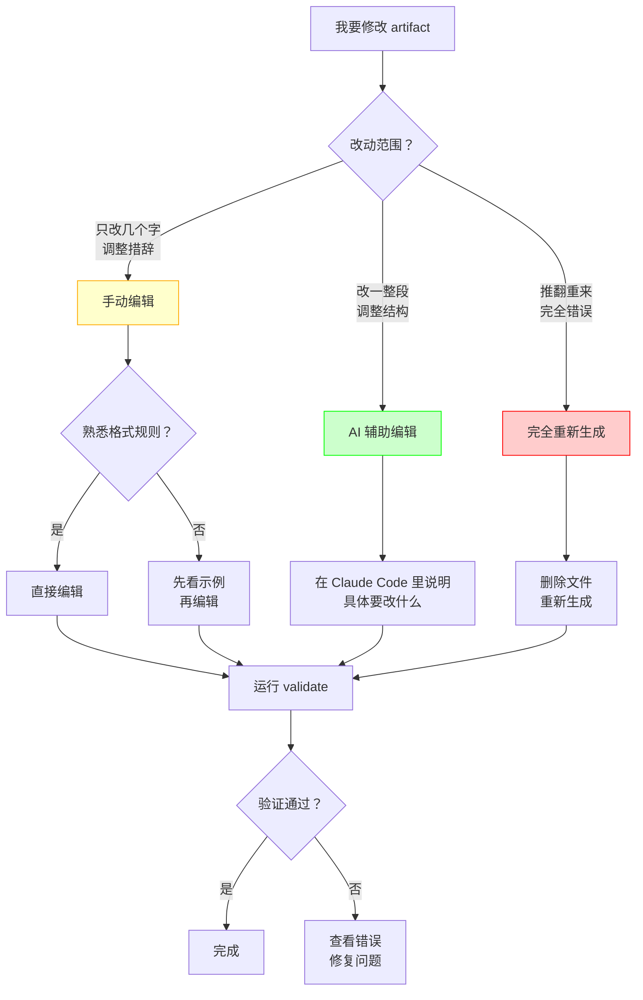

# 12 · 实战：如何正确修改 Artifacts

> 这一篇解决新手最困惑的问题：**OpenSpec 的 artifacts 到底该怎么改？** 和别的 SDD 工具不同，OpenSpec 是**弱约束**——artifacts 归你所有，可以手改、可以让 AI 重写、改完跑 `validate`。本文教你在这个自由度下，按文件类型安全地改、不踩格式坑。core profile 是默认前提，见下方专节。

---

## 重要前提：Profile 说明

OpenSpec 有两种 profile（配置模式）：

这里列出的 `/opsx:*` 是 OpenSpec workflow 投递到 agent 工具里的命令入口，不是另一套叫 OPSX 的独立工具。终端里的底层 CLI 仍然是 `openspec ...`。

| Profile | 命令数量 | 适用场景 | 是否默认 |
|---------|---------|---------|---------|
| **core** | 5 个命令（v1.4.0 起） | 快速开发，简单场景 | 是（默认） |
| **custom** | 11 个命令 | 复杂项目，需要更多控制 | 否 |

### 检查你当前的 Profile

```bash
# 查看当前 profile
openspec config profile

# 输出示例
# profile: core
```

### Core Profile 的 5 个命令

```bash
/opsx:propose <name>   # 创建 change + 生成所有 artifacts
/opsx:explore          # 探索/调研模式
/opsx:apply [name]     # 实现 tasks
/opsx:sync             # 同步 delta specs（v1.4.0 从 custom 移入 core）
/opsx:archive [name]   # 归档 change
```

### Custom Profile 的额外命令

```bash
/opsx:new <name>       # 只创建 change 目录
/opsx:continue         # 逐个生成 artifact
/opsx:ff               # 快速生成所有 artifacts
/opsx:verify           # 验证实现与 specs 一致性
/opsx:bulk-archive     # 批量归档
/opsx:onboard          # 新成员快速了解项目
```

### 如何切换到 Custom Profile

```bash
# 步骤 1：切换 profile
openspec config profile
# 选择 "custom" 或输入你想启用的 workflows

# 步骤 2：更新 AI 工具的 skills
openspec update

# 步骤 3：重启 Claude Code 或你的 AI 工具
```

### 本文档的假设

**本文档中的某些示例使用 custom profile 的命令**（如 `/opsx:continue`）。

如果你使用 **core profile**（默认），请参考每个场景下的"Core Profile 替代方案"。

---

## 为什么需要这一篇

如果你已经读过前面的文档，会用 `/opsx:propose`、`/opsx:apply`、`/opsx:archive`，但可能还有这些困惑：

| 困惑 | 典型问题 |
|------|---------|
| **config.yaml 怎么改？** | 手改怕破坏格式，但没有"推荐修改方式" |
| **proposal.md 怎么改？** | 直接手改？还是让 AI 重新生成？ |
| **specs 有问题怎么调整？** | 改了会不会破坏 delta spec 格式？ |
| **design.md 怎么调整？** | 实现过程中发现设计不对，怎么办？ |
| **tasks.md 怎么调整？** | 任务拆分不合理，怎么改？ |
| **.openspec.yaml 怎么调整？** | 这个文件是干什么的？能改吗？ |

这一篇重点展开最常改、也最容易改坏的两类文件：`config.yaml` 和 `proposal.md`。后面的 specs/design/tasks/.openspec.yaml 会给出安全修改原则，避免把本文变成逐字段手册。

---

## 修改 Artifacts 的三种方式

在开始具体讲解之前，先理解修改 artifacts 的三种基本方式：

### 方式对比表

| 方式 | 适用场景 | 优点 | 缺点 | 风险等级 |
|------|---------|------|------|---------|
| **手动编辑** | 小改动、微调措辞、添加细节 | 快速、精确、保留上下文 | 可能破坏格式、需要熟悉规则 | 中等 |
| **AI 辅助编辑** | 中等改动、调整结构、重写某段 | 平衡灵活性和安全性 | 需要明确指令 | 低 |
| **完全重新生成** | 大改动、推翻重来、格式完全错误 | 保证格式正确、省心 | 丢失之前的手动修改 | 高 |

### 决策树：我该用哪种方式？



### 三种方式的详细说明

#### 方式 1：手动编辑

**什么时候用**：
- 修改几个字、调整措辞
- 添加一个新的 requirement 或 scenario
- 修改 Out of Scope
- 调整任务顺序

**优点**：
- 最快速
- 保留所有上下文
- 精确控制

**缺点**：
- 可能破坏格式（如果不熟悉规则）
- 需要手动保持一致性

**示例场景**：
```markdown
# 场景：proposal 的 Why 部分写得不够清楚

# 原文
## Why
Users want to export data.

# 手动改成
## Why
Customer service team needs to export filtered order data to CSV 
for offline reconciliation and sharing with the finance department.
```

#### 方式 2：AI 辅助编辑

**什么时候用**：
- 需要重写一整段
- 调整结构但保留大部分内容
- 不确定格式规则
- 需要添加复杂的 scenarios

**优点**：
- 保证格式正确
- 可以保留部分内容
- 不需要深入了解格式规则

**缺点**：
- 需要明确的指令
- 可能需要多次迭代

**示例场景**：
```markdown
# 场景：specs 里的 scenarios 不够完整

# 在 Claude Code 里说：
"请帮我在 specs/orders/spec.md 的 'Order CSV Export' requirement 里，
添加以下 scenarios：
1. 导出空列表时的处理
2. 导出超过 10000 条记录时的限制
3. 导出失败时的错误提示"
```

**完整操作步骤**：
1. 在 Claude Code 的聊天框里输入上述指令
2. AI 会读取当前的 spec 文件
3. AI 会分析并添加新的 scenarios
4. AI 会保持 delta spec 格式（ADDED/MODIFIED/REMOVED）
5. 检查 AI 的修改是否符合预期
6. 运行 `openspec validate <change-name>` 验证格式

#### 方式 3：完全重新生成

**什么时候用**：
- 整个 artifact 完全错误
- 需求发生重大变化
- 格式完全混乱无法修复
- 想从头开始

**优点**：
- 保证格式完全正确
- 省心，不需要手动修复

**缺点**：
- 丢失所有手动修改
- 需要重新审查内容

**示例场景（Custom Profile）**：
```bash
# 场景：proposal 完全偏离了需求，需要重写

# 步骤 1：删除文件
rm openspec/changes/add-csv-export/proposal.md

# 步骤 2：在 Claude Code 里重新生成
/opsx:continue
```

**示例场景（Core Profile 替代方案）**：
```bash
# 场景：proposal 完全偏离了需求，需要重写

# 步骤 1：删除文件
rm openspec/changes/add-csv-export/proposal.md

# 步骤 2：在 Claude Code 里说：
"请重新生成 proposal.md，需求是：[描述你的需求]"

# 或者，如果想重新开始整个 change
rm -rf openspec/changes/add-csv-export/
/opsx:propose add-csv-export
```


---

## 每个 Artifact 的详细修改指南

现在我们逐个讲解每个 artifact 的修改方法，包含大量真实场景和完整示例。

### 1. config.yaml — 项目级配置

#### 文件位置
```
openspec/config.yaml
```

#### 这个文件是干什么的？

`config.yaml` 是**项目级配置文件**，定义：
- 项目背景（技术栈、测试策略）
- 全局约束规则（编码规范、回归要求）
- 默认 schema 选择

**关键特点**：
- 影响**所有 change** 的生成质量
- 修改后，新创建的 change 会使用新配置
- 已存在的 change 不受影响

#### 可以手动改的内容

| 内容 | 示例 | 风险 |
|------|------|------|
| **context** | 添加技术栈信息 | 低 |
| **rules** | 添加项目约束 | 低 |
| **schema** | 改变默认 schema | 中 |

#### 不建议手动改的内容

| 内容 | 原因 | 替代方案 |
|------|------|---------|
| **YAML 结构** | 容易出错 | 让 AI 帮你改 |
| **复杂的嵌套规则** | 难以维护 | 用简单的列表 |

#### 完整示例：从空配置到强配置

**场景**：你刚 `openspec init`，得到一个最基础的 config.yaml

**初始状态**（空配置）：
```yaml
schema: spec-driven
```

**问题**：AI 生成的 artifacts 太泛泛，不符合项目特点。

**改进步骤**：

**步骤 1：添加项目背景**
```yaml
schema: spec-driven

context: |
  Project: OrderManagement
  Tech stack: TypeScript, React, Node.js, PostgreSQL
  Testing: Vitest (unit) + Playwright (e2e)
```

**效果**：AI 生成的 design.md 会考虑 TypeScript 和 React 的特点。

**步骤 2：添加基本约束**
```yaml
schema: spec-driven

context: |
  Project: OrderManagement
  Tech stack: TypeScript, React, Node.js, PostgreSQL
  Testing: Vitest (unit) + Playwright (e2e)
  Deployment: Vercel
  Compatibility: Support last 2 major versions

rules:
  specs:
    - New user-visible behavior must be reflected in specs before implementation
  tasks:
    - Core business logic should be developed test-first
  design:
    - Do not bypass domain module boundaries
```

**效果**：AI 生成的 tasks.md 会包含"先写测试"的任务。

**步骤 3：添加具体的 artifact 约束**

**注意**：OpenSpec 的 config.yaml 支持**结构化 rules 格式**（按 artifact 分类）：

```yaml
schema: spec-driven

context: |
  Project: OrderManagement
  Tech stack: TypeScript, React, Node.js, PostgreSQL
  Testing: Vitest (unit) + Playwright (e2e)
  Deployment: Vercel
  Compatibility: Support last 2 major versions

rules:
  proposal:
    - Include rollback plan if behavior changes existing flow
    - Estimate implementation time
  specs:
    - Add unhappy-path scenarios (error cases)
    - Include authorization checks
  design:
    - Explain migration risk when schema changes
    - Consider performance impact
  tasks:
    - Break down into tasks < 2 hours each
    - Include testing tasks
```

**效果**：每个 artifact 都会遵循这些约束。

**验证**：查看 OpenSpec 仓库的 `openspec/config.yaml` 可以看到真实的结构化 rules 示例。

#### 真实场景 1：添加新的技术栈约束

**场景**：项目引入了 tRPC，需要让 AI 知道这个约束。

**修改前**：
```yaml
context: |
  Tech stack: TypeScript, React, Node.js
```

**修改后**：
```yaml
context: |
  Tech stack: TypeScript, React, Node.js
  API: tRPC (type-safe RPC)
  Rules: All API calls must use tRPC procedures, no direct fetch
```

**如何修改**：

**方式 1：手动编辑**（推荐）
```bash
# 直接编辑文件
vim openspec/config.yaml
```

改完后用 `openspec schemas` 确认 schema 能被解析（`openspec validate` 主要验证 change/spec 结构，不是 config.yaml 专用校验器）。

**方式 2：让 AI 帮你改**
```markdown
# 在 Claude Code 里说：
"请帮我更新 openspec/config.yaml，在 context 里添加：
- API: tRPC (type-safe RPC)
- Rules: All API calls must use tRPC procedures, no direct fetch"
```

#### 真实场景 2：添加回归测试要求

**场景**：团队决定，所有涉及订单的 change 都必须保证回归测试通过。

**修改前**：
```yaml
rules:
  tasks:
    - Write tests for new features
```

**修改后**：
```yaml
rules:
  tasks:
    - Write tests for new features
    - Changes touching order domain must preserve order creation regression tests
    - Changes touching payment flow must preserve payment authorization tests
```

**效果**：AI 生成的 tasks.md 会包含"运行回归测试"的任务。

#### 真实场景 3：改变默认 schema

**场景**：你的项目不需要 design.md，想用更简单的 schema。

**修改前**：
```yaml
schema: spec-driven
```

**注意**：
- OpenSpec 支持 package、user、project 三层 schema 来源
- 如果你需要不同的 artifact 结构，优先在项目内创建 `openspec/schemas/<name>/`
- 运行 `openspec schemas` 查看可用 schema，运行 `openspec schema which <name>` 查看解析来源

**如何验证修改是否生效**：
```bash
# 创建一个新 change
/opsx:propose test-new-schema

# 检查生成的 artifacts
ls openspec/changes/test-new-schema/

# 应该看到不同的 artifact 结构
```

#### 常见错误和修复

**错误 1：YAML 格式错误**
```yaml
# 错误：缩进不对
rules:
- Write tests
  - Add docs
```

**修复**：
```yaml
# 正确：统一缩进
rules:
  - Write tests
  - Add docs
```

**错误 2：context 和 rules 混淆**
```yaml
# 错误：把约束写在 context 里
context: |
  Tech: TypeScript
  You must write tests
```

**修复**：
```yaml
# 正确：约束放在 rules 里
context: |
  Tech: TypeScript

rules:
  - Write tests for all new features
```

**错误 3：规则太模糊**
```yaml
# 错误：太模糊
rules:
  - Write good code
  - Be careful
```

**修复**：
```yaml
# 正确：具体明确
rules:
  - Keep domain code grouped by capability, not by technical layer
  - Do not bypass published module interfaces
```

#### 验证 config.yaml 的修改

**步骤 1：检查 schema 解析**

`openspec validate` 不是 `config.yaml` 专用校验器，它主要验证 change/spec。改完 `config.yaml` 后，如果你改过 `schema:`，先确认 schema 能被解析：

```bash
openspec schemas
openspec schema which <schema-name>
```

如果 YAML 解析失败、schema 名不存在，后续创建 change 或读取 instructions 时会暴露问题。

**注意**：这只能证明配置能被读取、schema 能被解析，不等于证明配置内容质量高。

**它能帮你发现**：
- YAML 无法解析
- `schema` 指向不存在的 schema
- schema 解析来源不是你以为的 project/user/package 层

**它不会检查**：
- rules 是否合理
- context 是否完整
- 约束是否有效

**步骤 2：检查 context/rules 是否生效**

先创建一个临时 change，再查看 artifact instructions：

```bash
# 查看 AI 会收到什么指令
openspec new change test-config-runtime
openspec instructions proposal --change test-config-runtime --json | jq '.context, .rules'

# 检查完后删除临时 change
rm -rf openspec/changes/test-config-runtime/
```

**步骤 3：创建测试 change 验证**

**Custom Profile**：
```bash
# 创建一个测试 change
/opsx:propose test-config-output

# 检查生成的 proposal 是否符合新的 rules
cat openspec/changes/test-config-output/proposal.md

# 如果满意，删除测试 change
rm -rf openspec/changes/test-config-output/
```

**Core Profile**：
```bash
# 创建一个测试 change（会生成所有 artifacts）
/opsx:propose test-config-output

# 检查生成的 proposal 是否符合新的 rules
cat openspec/changes/test-config-output/proposal.md

# 如果满意，删除测试 change
rm -rf openspec/changes/test-config-output/
```


### 2. proposal.md — 变更提案

#### 文件位置
```
openspec/changes/<change-name>/proposal.md
```

#### 这个文件是干什么的？

`proposal.md` 是**变更提案**，回答：
- **Why**：为什么要做这个 change？
- **What Changes**：要改什么？
- **Out of Scope**：明确不做什么？
- **Approach**（可选）：大致怎么做？

**关键特点**：
- 是整个 change 的**起点**
- 定义了 change 的**边界**
- 其他 artifacts（specs/design/tasks）都基于它

#### 必须保留的结构

```markdown
## Why
<为什么做这个 change>

## What Changes
<要改什么>

## Out of Scope
<明确不做什么>
```

**注意**：标题（`## Why` 等）必须保留，但内容可以自由修改。

#### 真实场景 1：Why 部分太简单，需要补充背景

**场景**：AI 生成的 proposal 太简单，没有说清楚业务背景。

**原始内容**：
```markdown
## Why
Users want to export orders.
```

**问题**：
- 哪些用户？
- 为什么要导出？
- 解决什么问题？

**修改方式 1：手动编辑**（推荐）
```markdown
## Why
Customer service team needs to export filtered order data to CSV for:
1. Offline reconciliation with payment records
2. Sharing with finance department for monthly reporting
3. Investigating customer complaints with detailed order history

Current pain point: They have to manually copy-paste data from the UI, 
which is error-prone and time-consuming (30+ minutes per report).
```

**修改方式 2：让 AI 辅助**

**Custom Profile**：
```markdown
# 在 Claude Code 里说：
"请帮我扩展 proposal.md 的 Why 部分，补充以下信息：
- 用户是客服团队
- 用途是对账、报告、调查投诉
- 当前痛点是手动复制粘贴，耗时 30 分钟"
```

**Core Profile（相同）**：
```markdown
# 在 Claude Code 里说（操作相同）：
"请帮我扩展 proposal.md 的 Why 部分，补充以下信息：
- 用户是客服团队
- 用途是对账、报告、调查投诉
- 当前痛点是手动复制粘贴，耗时 30 分钟"
```

**完整操作步骤**：
1. 在 Claude Code 的聊天框里输入上述指令
2. AI 会读取当前的 proposal.md
3. AI 会分析并扩展 Why 部分
4. 检查 AI 的修改是否符合预期
5. 如果不满意，继续给出更具体的指令

#### 真实场景 2：Out of Scope 不够明确

**场景**：担心 scope 失控，需要明确不做什么。

**原始内容**：
```markdown
## Out of Scope
- Advanced features
```

**问题**：太模糊，"advanced features" 是什么？

**修改后**：
```markdown
## Out of Scope
- XLSX export (only CSV in this change)
- Scheduled/automated exports (manual only)
- Background export jobs (synchronous only)
- Email delivery of exported files
- Custom column selection (export all columns)
- Export history tracking
```

**为什么这样改**：
- 具体列出不做的功能
- 避免后续 scope 蔓延
- 让 AI 和团队都清楚边界

#### 真实场景 3：发现需求变了，需要调整 What Changes

**场景**：实现过程中，产品经理说"还要支持导出 PDF"。

**原始内容**：
```markdown
## What Changes
- Add CSV export button to Orders page
- Export filtered order data
```

**选择 1：扩大 scope（不推荐）**
```markdown
## What Changes
- Add export button to Orders page
- Support CSV and PDF formats
- Export filtered order data
```

**问题**：scope 变大了，可能影响工期。

**选择 2：保持 scope，创建新 change（推荐）**
```markdown
# 保持当前 proposal 不变
## What Changes
- Add CSV export button to Orders page
- Export filtered order data

# 创建新的 change
/opsx:propose add-order-pdf-export
```

**为什么推荐选择 2**：
- 保持每个 change 小而聚焦
- 可以分批上线
- 降低风险

#### 真实场景 4：Approach 部分需要调整

**场景**：实现过程中发现同步导出会阻塞，需要改成异步。

**原始内容**：
```markdown
## Approach
Generate CSV on demand and return as file download.
```

**修改后**：
```markdown
## Approach
~~Generate CSV on demand and return as file download.~~

**Updated approach** (discovered during implementation):
- Use background job for CSV generation (avoid blocking)
- Show progress indicator while generating
- Download link available when complete
- Job timeout: 5 minutes

**Reason for change**: 
Synchronous generation blocks the UI for large datasets (10k+ orders).
Background job provides better UX.
```

**如何修改**：

**方式 1：手动编辑**（推荐）
```bash
# 直接编辑文件
vim openspec/changes/add-csv-export/proposal.md

# 用删除线标记旧内容，添加新内容
```

**方式 2：让 AI 帮你更新**
```markdown
# 在 Claude Code 里说：
"我发现同步导出会阻塞 UI，请帮我更新 proposal.md 的 Approach，
改成异步后台任务，包括：
- 后台任务生成 CSV
- 显示进度条
- 完成后提供下载链接
- 超时 5 分钟

并说明原因：同步方式在大数据集时会阻塞 UI"
```

#### 完整示例：一个好的 proposal.md

```markdown
# Proposal: Add Order CSV Export

## Why
Customer service team needs to export filtered order data to CSV for:
1. Offline reconciliation with payment records
2. Sharing with finance department for monthly reporting
3. Investigating customer complaints with detailed order history

**Current pain point**: 
They have to manually copy-paste data from the UI, which is error-prone 
and time-consuming (30+ minutes per report).

**Business impact**: 
- Save 2 hours/week per CS agent (5 agents = 10 hours/week)
- Reduce reconciliation errors
- Faster response to customer complaints

## What Changes
- Add "Export CSV" button to Orders page (next to filter controls)
- Export currently filtered order data
- Include columns: Order ID, Date, Customer, Amount, Status, Payment Method
- Restrict to authorized staff users only

## Out of Scope
- XLSX export (only CSV in this change)
- Scheduled/automated exports (manual only)
- Background export jobs (synchronous only, <1000 orders)
- Email delivery of exported files
- Custom column selection (export all columns)
- Export history tracking

## Approach
Generate CSV on demand from the filtered order query and return as file download.

**Technical constraints**:
- Limit to 1000 orders per export (prevent timeout)
- Use streaming to avoid memory issues
- Sanitize data to prevent CSV injection

## Success Criteria
- CS team can export filtered orders in <5 seconds
- Exported CSV matches UI filter exactly
- No performance impact on Orders page load
```

#### 常见错误和修复

**错误 1：删除了必需的标题**
```markdown
# 错误：删除了 ## Why
This change adds CSV export.
```

**修复**：
```markdown
# 正确：保留标题
## Why
This change adds CSV export to help CS team with reporting.
```

**错误 2：Out of Scope 太模糊**
```markdown
# 错误
## Out of Scope
- Other stuff
```

**修复**：
```markdown
# 正确
## Out of Scope
- XLSX export
- Scheduled exports
- Background jobs
```

**错误 3：What Changes 和 Approach 混淆**
```markdown
# 错误：把实现细节写在 What Changes
## What Changes
- Use streaming CSV generation with Papa Parse library
- Add button with onClick handler
```

**修复**：
```markdown
# 正确：What Changes 写"做什么"，Approach 写"怎么做"
## What Changes
- Add CSV export button
- Export filtered order data

## Approach
Use streaming CSV generation with Papa Parse library.
```

#### 何时需要重新生成 proposal？

| 场景 | 是否重新生成 | 推荐做法 |
|------|-------------|---------|
| 微调措辞 | 不需要 | 手动编辑 |
| 补充背景信息 | 不需要 | 手动编辑或 AI 辅助 |
| 调整 Out of Scope | 不需要 | 手动编辑 |
| 需求完全变了 | 需要 | 删除后让 AI 重新生成 |
| 格式完全乱了 | 需要 | 删除后让 AI 重新生成 |

**重新生成的步骤（Custom Profile）**：
```bash
# 1. 删除文件
rm openspec/changes/add-csv-export/proposal.md

# 2. 在 Claude Code 里重新生成
/opsx:continue
```

**重新生成的步骤（Core Profile）**：
```bash
# 1. 删除文件
rm openspec/changes/add-csv-export/proposal.md

# 2. 在 Claude Code 里说：
"请重新生成 proposal.md，需求是：[详细描述你的需求]"

# 或者，重新开始整个 change
rm -rf openspec/changes/add-csv-export/
/opsx:propose add-csv-export
```

---

### 3. specs/design/tasks/.openspec.yaml — 其他文件怎么改

这几类文件也能改，但修改原则不一样：

| 文件 | 推荐修改方式 | 关键风险 |
|------|--------------|----------|
| `specs/<capability>/spec.md` | 小步编辑 delta spec，保留 `ADDED/MODIFIED/REMOVED/RENAMED` 结构和 scenarios | 把增量规格写成全量重写 |
| `design.md` | 实现发现方案变化时及时回改，说明原因和风险 | 只改代码不改设计，后人看不到真实取舍 |
| `tasks.md` | apply 过程中同步更新 checkbox，必要时拆细任务 | 任务状态和实现状态脱节 |
| `.openspec.yaml` | 一般不手动改；只在明确要改 schema 绑定或元数据时改 | 改错 schema 会影响后续 status/instructions 解析 |

一个实用判断：

- 行为承诺变了，优先改 delta spec
- 技术路径变了，优先改 design
- 执行拆解变了，优先改 tasks
- change 的 schema/元数据变了，才考虑 `.openspec.yaml`

改完这些文件后，再运行：

```bash
openspec validate <change-name>
openspec status --change <change-name> --json
```

前者检查 change/spec 结构，后者检查当前 artifact 状态和下一步运行时上下文。

---

## 下一步

- artifacts 会安全改了，想看复杂系统从零开始怎么用多个 spec + design 建第一版基线 → [13 实战·从零设计较复杂系统](13-实战-从零开始设计一个较复杂系统.md)
- 想看一个 change 从头到尾走完整条主线 → [11 实战·从真实 change 走完整条主线](11-实战-从一个真实-change-走完整条主线.md)
- 多人改同一份 spec / Git 协作时怎么不踩坑 → [15 实战·多人协作与 Git 工作流](15-实战-多人协作与Git工作流.md)
