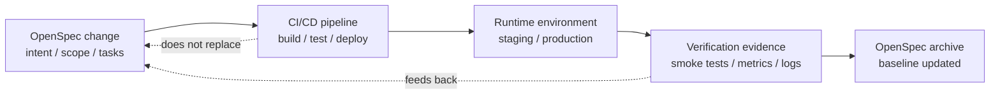

# 14 · 实战：用 OpenSpec 管理 DevOps 部署与验证

> 这一篇讲的是：实现已经写出来以后，怎么把部署、验证、回滚也纳入 OpenSpec 的 change 闭环。
> OpenSpec 不是 CI/CD 系统，但它很适合把部署这件事讲清楚、做有序、验有据。

> **v1.11.0 实施/归档提示。** 将持续的部署检查写进 `operations.apply/archive.guidance`，但每个生成的 task 仍要在同一 checkbox 中声明 verification；只有跨多项工作的系统检查才单列 Integration Verification。prompt 不替代 CI。

---

## 先把边界说清楚

OpenSpec 不替代这些东西：

- GitHub Actions / GitLab CI / Jenkins
- Argo CD / Flux / Spinnaker
- Terraform / Pulumi / Helm / Kubernetes
- Datadog / Grafana / Prometheus / Sentry
- 你们已有的发布平台和告警系统

它真正适合做的是：

> **把一次部署当作 change 的一部分来规划、执行、验证和 archive。**

也就是说：

- CI/CD 负责跑自动化
- 监控系统负责观察线上状态
- OpenSpec 负责把"为什么部署、部署什么、怎么验证、失败怎么办"沉淀成可审查的 artifacts

如果把边界画出来，大概是这样：



---

## 为什么部署也需要 OpenSpec

很多团队的部署问题，不是没有自动化，而是缺少部署前后的共同语言：

| 常见问题 | 表现 | OpenSpec 能补上的东西 |
|----------|------|----------------------|
| 部署边界不清 | "这次顺手也改了配置和 migration" | proposal 明确 scope / out of scope |
| 验证标准不清 | "看起来没报错就算成功" | tasks 写明 post-deploy verification |
| 回滚条件不清 | "要不要回滚靠临场判断" | design 写明 rollback guard |
| 证据散落 | CI 链接、日志、截图到处都是 | tasks / summary 记录关键证据 |
| spec 与线上脱节 | 代码部署了，但 specs 没沉淀 | archive 才算闭环 |

所以这里的核心不是"用 OpenSpec 跑部署"，而是：

> **用 OpenSpec 管理部署的意图、风险、步骤、验证证据和完成定义。**

---

## 一个真实场景：上线 施工任务 CSV 导出

假设 `add-task-csv-export` 已经在本地实现完成，tasks 大部分也已经勾上了。

现在还剩最后一段工作：

- 合并到 main
- 部署到 staging
- 做 smoke test
- 部署到 production
- 验证线上结果
- archive change

这时不要把部署当成"代码写完后的口头操作"。

更好的做法是把部署和验证写进 `tasks.md`：

```markdown
# Tasks

## 1. Implementation
- [x] Add backend CSV export endpoint — verify: API integration test returns filtered CSV
- [x] Add frontend export button — verify: component test finds the action for authorized staff
- [x] Add authorization checks — verify: unauthorized request returns 403
- [x] Add unit and integration tests — verify: targeted test command passes

## 2. Pre-deploy checks
- [x] Run unit tests — verify: unit-test command exits 0
- [x] Run integration tests — verify: integration-test command exits 0
- [x] Confirm CSV injection sanitization — verify: malicious spreadsheet formulas are escaped in a focused test
- [x] Confirm no schema migration is required — verify: schema diff is empty

## 3. Staging deployment
- [ ] Deploy to staging — verify: release dashboard reports the target build healthy
- [ ] Run task export smoke test in staging — verify: smoke command exits 0
- [ ] Verify exported rows match active filters — verify: row count and IDs equal the UI result
- [ ] Check application logs for export errors — verify: no new export errors appear in the deployment window

## 4. Production rollout
- [ ] Deploy to production during normal release window — verify: production reports the intended build healthy
- [ ] Run production smoke test with staff account — verify: a filtered CSV downloads successfully
- [ ] Verify p95 export latency remains under 5 seconds — verify: dashboard query stays below threshold
- [ ] Monitor errors for 30 minutes after deploy — verify: error-rate alert remains clear for the full window

## 5. Archive readiness
- [ ] Record deploy evidence in final summary — verify: summary links the release, smoke run, and dashboard
- [ ] Confirm no rollback was required — verify: release record shows healthy or records the rollback decision
- [ ] Archive change — verify: active change is absent and dated archive directory exists
```

这不是把 OpenSpec 变成 CI/CD。真正的 deploy 仍然由你的发布系统执行。

OpenSpec 只是把"这次部署怎样才算完成"变成明确协议。

---

## proposal 里应该怎么写部署边界

不是每个 change 都要写复杂部署说明。

但只要涉及线上行为、配置、迁移、权限、外部依赖，就应该在 proposal 里把发布边界说清楚。

示例：

```markdown
## Scope
- Add CSV export for filtered task list
- Restrict export to authorized staff users
- Deploy as part of normal web/API release

## Out of Scope
- Scheduled exports
- Background export jobs
- New data retention policy
- Separate reporting service

## Deployment Impact
- No database migration required
- No new infrastructure required
- Uses existing API and frontend release pipeline
- Requires post-deploy smoke test with staff account
```

这段的价值是提前防止两类失控：

- 实现 scope 失控：从 施工任务 CSV 导出演变成 reporting 平台
- 发布 scope 失控：从普通发布演变成基础设施变更

---

## design 里应该怎么写部署风险

`design.md` 不是只写代码结构。

对有线上影响的 change，它还应该写清楚：

- rollout 方式
- migration 风险
- feature flag 策略
- 监控指标
- 回滚条件
- 不回滚但需要降级的条件

示例：

```markdown
## Rollout Plan
- Deploy backend and frontend in the same release.
- Keep export limited to staff roles.
- No feature flag is required because the button is only visible to authorized staff.

## Verification
- Run staging smoke test before production.
- In production, export a filtered task list using a staff test account.
- Confirm CSV row count matches UI filtered count.
- Monitor export endpoint error rate and p95 latency for 30 minutes.

## Rollback
- If export endpoint error rate exceeds 1% for 10 minutes, roll back the release.
- If CSV content is incorrect but endpoint is stable, hide the frontend button and keep backend deployed for investigation.
- No data migration rollback is required.
```

这类内容不该只留在发布群聊天里。

它是这次 change 的一部分。

---

## 部署后的自动化验证怎么接进来

OpenSpec 不跑自动化，但 `tasks.md` 可以明确调用哪些自动化。

常见验证可以分成五类：

| 验证类型 | 例子 | 适合记录在哪里 |
|----------|------|----------------|
| Build/Test | unit、integration、e2e | `tasks.md` pre-deploy checks |
| Smoke Test | 登录、关键 API、关键 UI 路径 | `tasks.md` staging / production |
| Data Check | migration count、数据一致性 | `design.md` + `tasks.md` |
| Observability | error rate、latency、logs、alerts | `design.md` verification |
| Business Signal | 订单导出成功率、任务完成率 | `tasks.md` post-deploy evidence |

一个更自动化的 tasks 写法可以是：

```markdown
## 3. Staging verification
- [ ] Run `npm run test:e2e -- --grep "task export"` — verify: command exits 0
- [ ] Run `scripts/smoke/export-tasks.sh staging` — verify: command exits 0 and downloads a valid CSV
- [ ] Attach CI run URL to final summary — verify: URL is present and accessible to reviewers

## 4. Production verification
- [ ] Run `scripts/smoke/export-tasks.sh production` — verify: command exits 0 and downloads a valid CSV
- [ ] Check dashboard: API error rate, p95 latency, export count — verify: all three remain within the rollout guard
- [ ] Confirm no new Sentry errors for export endpoint — verify: deployment-window search returns no regression
```

注意这里的动作仍然是你已有工具在执行。

OpenSpec 只要求它们被纳入 change 的完成标准。

---

## 什么情况下 deployment 应该是单独 change

有些部署只是实现 change 的尾声。

但有些部署本身就应该单独开 change。

| 场景 | 建议 |
|------|------|
| 普通应用发布 | 放进原 feature change 的 tasks |
| 小配置调整 | 视风险大小，可放原 change |
| 数据库 migration 风险高 | 单独 change 或至少单独 design section |
| 基础设施变更 | 单独 change |
| 多阶段 rollout | 单独 change 更清楚 |
| 回滚策略复杂 | 单独 change 更清楚 |
| 跨多个 repo / 服务部署 | 通过 store `references:` 引用其他仓库 specs + repo 级 changes |

判断法很简单：

> **如果部署动作本身需要独立 review、独立验证、独立回滚，它就值得成为单独 change。**

---

## archive 前的完成定义

对带部署的 change，`archive` 不应该只表示"代码写完"。

更好的完成定义是：

```text
implementation done
  + tests passed
  + deployed to target environment
  + post-deploy verification passed
  + rollback not required, or rollback decision recorded
  + specs are ready to become baseline
```

这时再 archive，语义才完整：

- `openspec/specs/` 表示当前正式能力
- `openspec/changes/archive/` 保留这次 change 历史
- 部署验证证据留在 change 的 tasks / summary / PR 中

---

## 失败时怎么办

部署失败不是 OpenSpec 流程失败。

它只是说明 change 还没有达到 archive-ready。

常见处理方式：

| 情况 | OpenSpec 处理 |
|------|---------------|
| CI 失败 | 不勾 deployment tasks，修实现或测试 |
| staging smoke test 失败 | 回头修改 design/tasks，修复后重测 |
| production 部署失败但已回滚 | 记录回滚结果，继续保持 change active |
| production 部署成功但指标异常 | 按 rollback guard 决策，记录证据 |
| 发现需求本身有误 | 回头修改 proposal/specs/design，再重新 apply |

关键是：

> **不要因为部署失败就绕开 OpenSpec；失败本身就是 change 需要记录和消化的事实。**

---

## 一个建议的 DevOps change checklist

可以把下面这组 checklist 复制到高风险 change 的 `tasks.md`：

```markdown
## Deployment readiness
- [ ] All implementation tasks complete — verify: no earlier checkbox remains open
- [ ] Tests passing locally or in CI — verify: required check suite is green
- [ ] Migration impact reviewed — verify: design records migration/no-migration conclusion
- [ ] Rollback plan documented — verify: design names trigger, owner, and action
- [ ] Monitoring dashboard or alert path identified — verify: tasks link the dashboard or alert

## Staging
- [ ] Deploy to staging — verify: target build reports healthy
- [ ] Run smoke tests — verify: smoke command exits 0
- [ ] Verify logs and metrics — verify: no guard threshold is breached
- [ ] Confirm stakeholder acceptance if needed — verify: acceptance evidence is linked

## Production
- [ ] Deploy to production — verify: target build reports healthy
- [ ] Run production smoke tests — verify: smoke command exits 0
- [ ] Monitor error rate and latency — verify: rollout window stays within documented guards
- [ ] Record deploy link / CI run / dashboard evidence — verify: final summary contains all required links

## Completion
- [ ] Rollback not required, or rollback result recorded — verify: release record states the final decision
- [ ] Specs still match shipped behavior — verify: reviewer compares shipped flow with delta scenarios
- [ ] Archive change — verify: active change is absent and dated archive directory exists
```

---

## 压缩结论

1. OpenSpec 不是 CI/CD，也不应该伪装成 CI/CD
2. OpenSpec 适合管理部署 change 的意图、风险、步骤、验证和证据
3. 部署动作可以写进 `tasks.md`，部署风险应该写进 `design.md`
4. 自动化验证仍然由已有工具执行，但完成标准要回到 OpenSpec
5. 高风险部署值得单独开 change
6. archive 最好发生在部署验证通过之后
7. 部署失败不是流程失败，而是 change 还没完成

---
