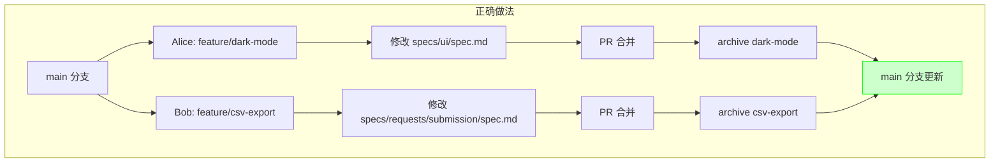
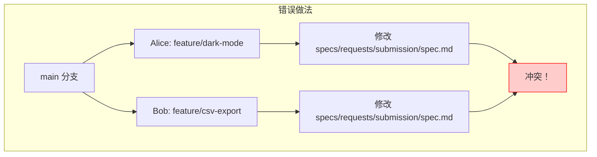
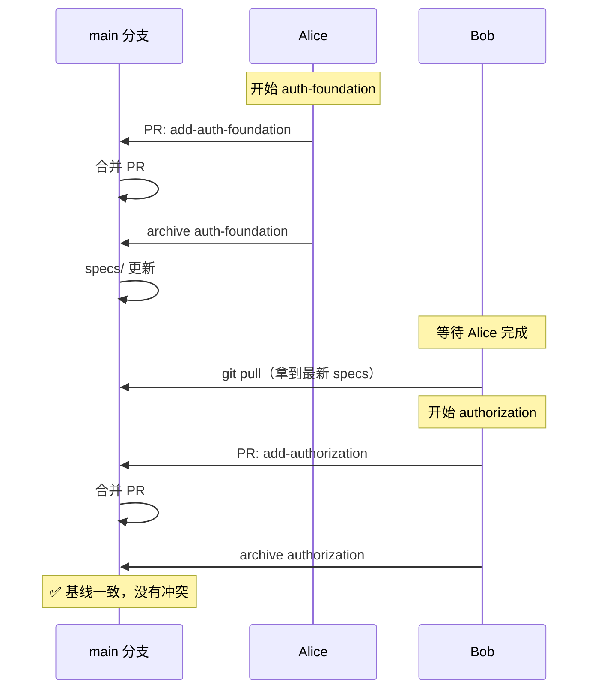
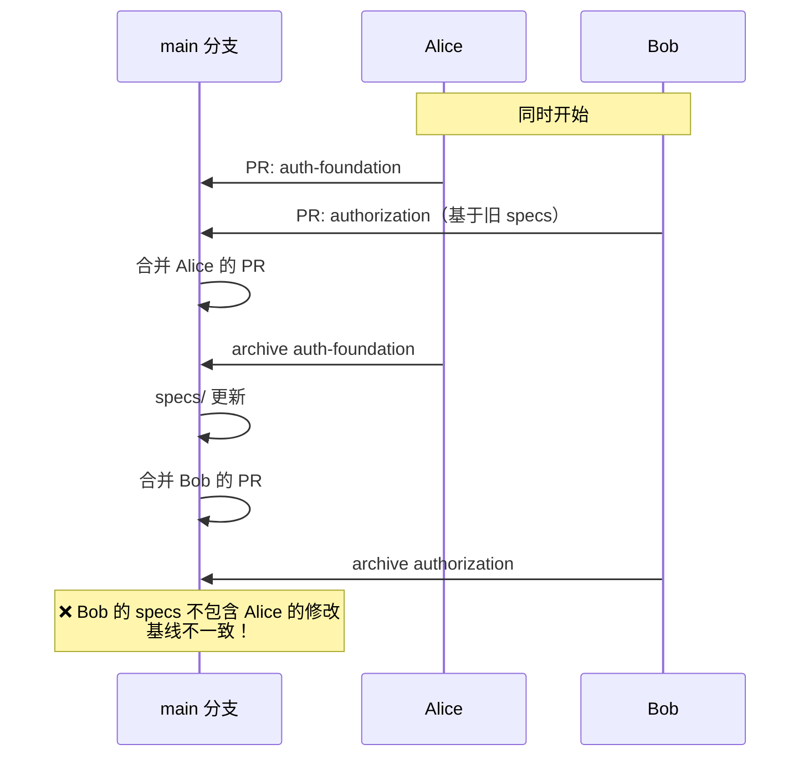
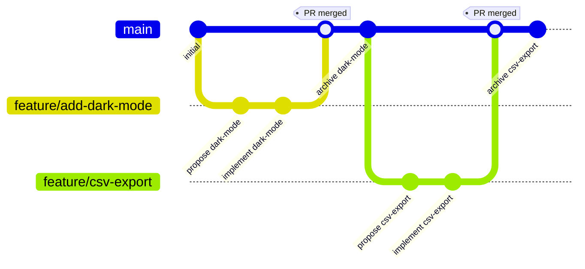
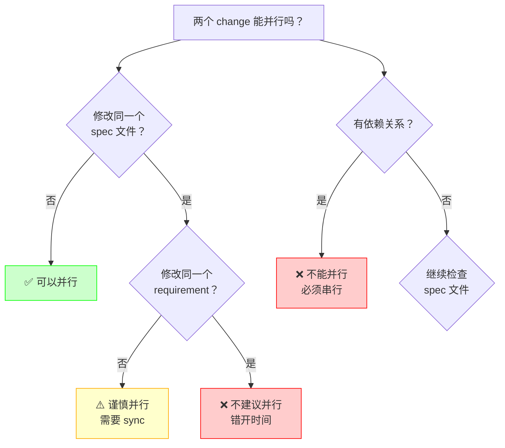

# 15 · 实战：多人协作与 Git 工作流

> 多人用 OpenSpec + Git 时，**绝大多数冲突都来自一件事：有人忘了"一个 change = 一个分支、PR 合并后立即 archive"这条纪律。** 这一篇把这条纪律拆成 4 个场景（独立功能 / 有依赖 / 改同一个 spec / 紧急 bugfix），告诉你每一步敲哪条命令、archive 顺序错会怎样、怎么用 PR 串行化避免基线不一致。

> **v1.13.1 协作边界。** “一个 change = 一个分支、合并后 archive”是强烈推荐的团队纪律，不是 CLI 硬校验。同 path 仍需串行化/重基线；退役还必须同时处理在途 MODIFIED 与 main spec 中的 orphan content。

---

## 为什么多人协作需要特别注意

OpenSpec 的设计天然支持多人协作，但如果不了解最佳实践，容易遇到这些问题：

| 问题 | 表现 | 后果 |
|------|------|------|
| **并行修改同一个 spec** | 两个 change 都修改同一 capability path | archive 中止；后者必须基于最新 main spec 重写 delta |
| **change 依赖关系不清** | change B 依赖 change A 的结果 | B 先 archive 会导致基线不一致 |
| **Git 分支策略混乱** | 不知道 change 和 Git 分支怎么对应 | 代码和 specs 不同步 |
| **archive 顺序错误** | 后者仍基于旧基线 archive | archive 拒绝不匹配 delta；需要 rebaseline，而不是覆盖先前结果 |

---

## 核心原则：一个 change = 一个 Git 分支

**最佳实践**：

```text
Git 分支                    OpenSpec change
────────────────────────    ────────────────────────────
feature/add-dark-mode  ←→  changes/add-dark-mode/
bugfix/fix-login       ←→  changes/fix-login-redirect/
feature/csv-export     ←→  changes/add-csv-export/
```

**为什么这样做**：
- 代码和 specs 保持同步
- Git 的分支管理能力可以直接用于 change 管理
- PR review 时可以同时看到代码和 specs 的变化
- 回滚时代码和 specs 一起回滚

---

## 标准协作流程（推荐）

### 场景 1：独立功能，无依赖

**团队成员 A**：做深色模式
**团队成员 B**：做 CSV 导出

这两个功能互不依赖，可以完全并行。

#### 成员 A 的工作流

```bash
# 1. 创建 Git 分支
git checkout -b feature/add-dark-mode

# 2. 在 Claude Code 里发起 change
/opsx:propose add-dark-mode

# 3. 实现功能
/opsx:apply add-dark-mode

# 4. 提交代码和 specs
git add openspec/changes/add-dark-mode/
git add src/  # 实际代码改动
git commit -m "Add dark mode support"

# 5. 推送并创建 PR
git push -u origin feature/add-dark-mode
gh pr create --title "Add dark mode"

# 6. PR 合并后，archive change
git checkout main
git pull
/opsx:archive add-dark-mode

# 7. 提交 archive 结果
git add openspec/specs/
git add openspec/changes/archive/
git commit -m "Archive add-dark-mode change"
git push
```

#### 成员 B 的工作流

完全相同的流程，只是 change 名字不同。两人可以完全并行工作，互不干扰。

**关键点**：
- 各自在独立的 Git 分支上工作
- 各自的 change 修改不同的 spec 文件
- archive 顺序无所谓（因为没有依赖）

### 并行的真正边界是 capability path，不是 Git 分支名

“两个人各有一条分支”只能隔离 Git 文件修改，不能保证两份 delta 都基于兼容的行为基线。协作前把 change 按完整 capability path 分成下面三类：

| 两个 change 的关系 | 能否并行实施 | archive 前必须做什么 |
|---|---|---|
| 不同 path，且没有跨域行为耦合 | 可以 | 各自 validation；正常 archive |
| 不同 path，但共享身份、权限、兼容性或事件语义 | 可以有限并行 | proposal 写 impact matrix；彼此至少 verify relevant spec |
| 同一 path，或会改同一 requirement | 实现可并行，spec 基线不能各自独立推进 | 指定顺序；前一个 archive 后，后一个重读 main spec、重写 delta 并验证 |
| taxonomy 本身要改（拆分/合并/移动 path） | 不应当作普通 feature 并行 | 单独 rebaseline，先盘点所有 active changes |

例如 Alice 改 `identity/session` 的 refresh，Bob 改 `identity/session` 的 expiry。如果 Bob 的 delta 是从 Alice archive 前的 requirement block 写的，Bob 不应直接 archive。正确节奏是：

```text
Alice archive identity/session
  → Bob 更新 main
  → Bob 读取最新 requirement + scenarios
  → Bob 重新基线自己的 MODIFIED delta
  → Bob strict validate
  → Bob archive
```

已由独立 sync 写入的**完全一致** delta 在 v1.8.0（v1.7.0 起）可成为 archive no-op；这只是降低了“已正确同步”的重复写入风险。它不等于两个不同改动自动合并，更不能代替上面的重读、review 和 rebaseline。

团队可以在 PR 描述中固定一张小表，让这种协调显式可见：

```markdown
| capability path | action | coordination |
|---|---|---|
| identity/session | MODIFIED | archive after #123; rebaseline against its main spec |
| identity/login | verify only | confirm login does not issue an invalid refresh token |
```

### 可视化：并行开发的正确姿势





---

### 场景 2：有依赖关系的功能

**成员 A**：先做用户认证基础设施
**成员 B**：基于认证做权限控制

B 依赖 A 的结果。

#### 成员 A 的工作流

```bash
# 1. 创建分支和 change
git checkout -b feature/add-auth-foundation
/opsx:propose add-auth-foundation

# 2. 实现并提交
/opsx:apply
git add openspec/changes/add-auth-foundation/
git add src/auth/
git commit -m "Add authentication foundation"
git push -u origin feature/add-auth-foundation

# 3. 创建 PR 并等待 review
gh pr create --title "Add authentication foundation"

# 4. PR 合并后立即 archive
git checkout main
git pull
/opsx:archive add-auth-foundation
git add openspec/
git commit -m "Archive add-auth-foundation"
git push
```

#### 成员 B 的工作流（依赖 A）

```bash
# 1. 等待 A 的 PR 合并和 archive 完成
# 确保 main 分支已经有了 A 的 specs

# 2. 从最新的 main 创建分支
git checkout main
git pull
git checkout -b feature/add-authorization

# 3. 发起 change（此时可以看到 A 的 specs）
/opsx:propose add-authorization

# 4. 在 proposal 里明确依赖关系
# 编辑 openspec/changes/add-authorization/proposal.md
# 添加：
## Dependencies
This change depends on `add-auth-foundation` being archived first.

# 5. 实现功能
/opsx:apply

# 6. 提交并创建 PR
git add openspec/changes/add-authorization/
git add src/auth/
git commit -m "Add authorization based on authentication"
git push -u origin feature/add-authorization
gh pr create --title "Add authorization"

# 7. PR 合并后 archive
git checkout main
git pull
/opsx:archive add-authorization
git add openspec/
git commit -m "Archive add-authorization"
git push
```

**关键点**：
- B 必须等 A archive 后再开始
- B 的 proposal 里明确写出依赖关系
- 这样可以避免基线不一致

### 可视化：依赖关系的正确处理



**错误做法**：Bob 不等 Alice，直接开始



---

### 场景 3：并行修改同一个 spec 文件（需要协调）

**成员 A**：给施工任务列表加过滤功能
**成员 B**：给施工任务列表加排序功能

两个功能都要修改 `specs/requests/submission/spec.md`。

#### 推荐做法：错开时间

```bash
# 团队协调：A 先做，B 后做

# 成员 A
git checkout -b feature/add-request-filter
/opsx:propose add-request-filter
/opsx:apply
git add openspec/ src/
git commit -m "Add request filter"
git push -u origin feature/add-request-filter
gh pr create --title "Add request filter"

# PR 合并后立即 archive
git checkout main
git pull
/opsx:archive add-request-filter
git add openspec/
git commit -m "Archive add-request-filter"
git push

# 成员 B 等 A 完成后再开始
git checkout main
git pull  # 拿到 A 的 specs 更新
git checkout -b feature/add-request-sort
/opsx:propose add-request-sort
# ... 后续流程相同
```

#### 如果必须并行：使用 sync 命令

如果 A 和 B 必须同时开始（比如紧急需求），可以这样：

```bash
# 成员 A 和 B 同时开始
# A: feature/add-request-filter
# B: feature/add-request-sort

# A 先完成并 archive
# （A 的流程省略）

# B 在 archive 前需要 sync
git checkout feature/add-request-sort
git pull origin main  # 拉取 A 的更新

# 运行 sync 命令（core profile 默认可用）
/opsx:sync add-request-sort

# 手动处理冲突（当前做法）
# 1. 查看 A 的 delta spec
cat openspec/changes/archive/*-add-request-filter/specs/requests/submission/spec.md

# 2. 合并到自己的 delta spec
# 编辑 openspec/changes/add-request-sort/specs/requests/submission/spec.md
# 确保包含 A 的修改 + 自己的修改

# 3. 提交并 archive
git add openspec/
git commit -m "Sync with add-request-filter changes"
/opsx:archive add-request-sort
```

**关键点**：
- 尽量错开时间，避免并行修改同一个 spec
- 如果必须并行，后 archive 的人要用 `/opsx:sync` 同步，并手动审查 delta spec 是否仍然准确
- `/opsx:sync` 在当前 core profile 中默认可用
- **退役 vs 在途修改**：若某人退役整个 capability，而另一个 in-flight change 仍在 MODIFIED 它——后者可能到 archive 才因 target 不存在而失败。退役 PR 必须盘点同 path 的 active changes，先完成/取消/重基线，而不是把 marker 当作抢占所有权。
- **退役 vs orphan content（v1.10.0）**：即使 `retire_capabilities: true` 已声明，main spec 里的 `## Notes`、orphan paragraph/section 等未归属内容也会阻止删除。CLI 会列 blocking lines；团队要先决定迁入 `## Purpose`/canonical requirement 还是经 review 删除，不能让退役者单方面抹掉其他人的治理信息。

---

## Git 分支策略推荐

### 策略 1：Feature Branch + PR（推荐）



**优点**：
- 每个 change 独立开发和 review
- PR 可以同时 review 代码和 specs
- 主分支始终保持稳定

**工作流**：
1. 从 main 创建 feature 分支
2. 在分支上完成 change（propose → apply）
3. 提交代码 + specs，创建 PR
4. PR 合并后，在 main 上 archive
5. 提交 archive 结果

### 策略 2：Stacked Changes（高级）

适合大功能拆分成多个小 change（工作流如下；不再用 gitGraph 图）：

**工作流**：
1. 先做 auth-foundation，PR 合并后 archive
2. 从 main 创建 auth-permissions 分支
3. 在 proposal 里声明依赖 auth-foundation
4. 依次完成并 archive

**优点**：
- 大功能可以分批 review 和上线
- 每个 change 保持小而聚焦

---

## 常见问题和解决方案

### Q1: 两个人同时 archive 了，怎么办？

这里先区分两类问题：OpenSpec 的 delta 与最新 main spec 不匹配时，archive 自己会中止且不写文件，应按本章前面的 rebaseline 步骤处理；下面说的是两条**已经完成 archive 的 Git 提交**在合并分支时产生的 Git conflict，才会出现 marker。

**场景**：
- 成员 A archive 了 change-a
- 成员 B 同时 archive 了 change-b
- 两个 archive 都修改了 `specs/requests/submission/spec.md`

**解决**：
```bash
# 后 push 的人会遇到 Git 冲突
git pull  # 会提示冲突

# 手动解决冲突
# 1. 打开 openspec/specs/requests/submission/spec.md
# 2. 找到冲突标记（<<<<<<< ======= >>>>>>>）
# 3. 合并两个 change 的修改
# 4. 删除冲突标记

git add openspec/specs/requests/submission/spec.md
git commit -m "Resolve archive conflict between change-a and change-b"
git push
```

**预防**：
- 团队约定：archive 前先 `git pull`
- 使用 PR 流程，让 archive 串行化

### Q2: 忘记 archive 就开始下一个 change 了

**场景**：
- 完成了 change-a，但忘记 archive
- 直接开始了 change-b
- change-b 看不到 change-a 的 specs

**解决**：
```bash
# 1. 先回去 archive change-a
/opsx:archive change-a
git add openspec/
git commit -m "Archive change-a (late)"
git push

# 2. 如果 change-b 已经开始，需要重新生成 specs
# 方式 1：重新 propose（如果还没写太多）
rm -rf openspec/changes/change-b/
/opsx:propose change-b

# 方式 2：手动更新 delta spec（如果已经写了很多）
# 编辑 openspec/changes/change-b/specs/
# 确保基于最新的 openspec/specs/
```

**预防**：
- 养成习惯：PR 合并后立即 archive
- 团队约定：每天结束前检查是否有未 archive 的 change

### Q3: 怎么知道哪些 change 可以并行？

**判断标准**：

| 条件 | 可以并行？ | 原因 |
|------|-----------|------|
| 修改不同的 spec 文件 | ✅ 可以 | 不会冲突 |
| 修改同一个 spec 的不同 requirement | ⚠️ 谨慎 | 可能冲突，需要 sync |
| 修改同一个 requirement | ❌ 不建议 | 肯定冲突，错开时间 |
| 有依赖关系 | ❌ 不能 | 必须串行 |

### 可视化：并行判断决策树



**当前做法**：OpenSpec 目前不会自动计算 change 依赖图。团队要把依赖关系写进 `proposal.md`、PR 描述或项目看板里，并在每天同步时确认谁在改哪个 spec。

### Q4: 怎么处理紧急 bugfix？

**场景**：
- 正在做 feature-a
- 突然来了紧急 bugfix

**推荐流程**：
```bash
# 1. 暂存当前工作
git stash  # 或者提交到当前分支

# 2. 切换到 main，创建 bugfix 分支
git checkout main
git pull
git checkout -b bugfix/critical-issue

# 3. 快速修复
/opsx:propose fix-critical-issue
/opsx:apply
git add openspec/ src/
git commit -m "Fix critical issue"
git push -u origin bugfix/critical-issue

# 4. 创建 PR，快速合并
gh pr create --title "Fix critical issue"

# 5. PR 合并后 archive
git checkout main
git pull
/opsx:archive fix-critical-issue
git add openspec/
git commit -m "Archive fix-critical-issue"
git push

# 6. 回到原来的工作
git checkout feature/feature-a
git rebase main  # 拉取最新的 specs
git stash pop  # 恢复之前的工作
```

---

## 团队协作最佳实践

### Do's and Don'ts 速查表

| 推荐做法 | 避免做法 |
|---|---|
| 一个 change 一个分支 | 多个 change 共用一个分支 |
| PR 合并后立即 archive | PR 合并后忘记 archive |
| 每天开始前 git pull | 从不 pull，基于旧代码 |
| 在 proposal 里声明依赖 | 依赖关系不写清楚 |
| 团队沟通谁改哪个 spec | 不沟通，盲目并行 |

### 1. 建立 change 命名规范

```text
功能类：feature/<name>  →  add-<feature>
修复类：bugfix/<name>   →  fix-<issue>
重构类：refactor/<name> →  refactor-<component>
```

### 2. 在 proposal 里声明依赖

```markdown
# Proposal: Add Authorization

## Dependencies
- `add-auth-foundation` must be archived first
- Requires `specs/auth/spec.md` to include authentication requirements

## Conflicts
- May conflict with `add-oauth-support` if both modify auth flow
```

### 3. 使用 PR template

创建 `.github/pull_request_template.md`：

```markdown
## OpenSpec Change
- Change ID: `<change-name>`
- Change Path: `openspec/changes/<change-name>/`

## Dependencies
- [ ] No dependencies
- [ ] Depends on: (list other changes)

## Specs Modified
- [ ] No spec changes
- [ ] Modified: (list spec files)

## Archive Checklist
- [ ] Code changes complete
- [ ] Tests passing
- [ ] Ready to archive after merge
```

### 4. 团队约定

**每日同步**：
- 每天开始前 `git pull`，确保基于最新 specs
- 只 archive 已合并到主分支、且按最新 main spec 验证通过的 change；未合并的 change 保持 active

**沟通机制**：
- 在团队频道宣布"我要修改 `requests/submission` capability"
- 避免多人同时修改同一个 spec

**Code Review**：
- Review 时同时看代码和 specs
- 确保 delta spec 准确反映了代码变化

---

## 高级话题：Change Stacking

**注意**：Change Stacking 是一个高级工作流模式，目前需要手动管理依赖关系。

当前更稳妥的做法，是把依赖关系写在人能看到、review 能检查的位置。

### 在 proposal 里声明依赖

```markdown
## Dependencies
- `add-auth-foundation` must be archived first.
- This change assumes `specs/auth/spec.md` already contains authentication requirements.

## Conflicts
- Coordinate with `add-oauth-support` if both changes modify login or session behavior.
```

### 在 PR 或看板里维护顺序

```markdown
Change order:
1. add-auth-foundation
2. add-authorization
3. add-role-management

Blocking rule:
- Do not start `add-authorization` until `add-auth-foundation` is archived on main.
```

### 用 review 检查冲突

`openspec validate` 能检查结构、格式和最低内容门槛（场景存在等；SHALL/MUST 自 v1.8.0 起是 guidance，normal 模式缺失仅 WARNING），但它不会替你判断两个并行 change 是否语义冲突。review 时要明确检查两件事：这次 delta spec 改了哪些 requirement，以及这些 requirement 是否正被另一个 active change 修改。

---

## `/opsx:sync`：不等 archive 就把 spec 合并回主线

### 为什么需要它

标准流程是 `propose → apply → archive`——archive 时才把 delta spec 合并回 `specs/`。但多人协作时这个节奏太慢了。

假设 Alice 和 Bob 同时开工：

```
Alice: add-qc-check     → 改 specs/quality/spec.md（新增 Requirement: Photo Verification）
Bob:   add-qc-report    → 也改 specs/quality/spec.md（修改 Requirement: Report Format）
```

如果 Alice 先 archive，Bob 的 delta 是基于旧 `specs/quality/spec.md` 写的——他的 `## MODIFIED Requirements: Report Format` 期望的是一个旧版本。等 Bob archive 时，要么合并冲突，要么更糟——Alice 新增的 `Photo Verification` 在 Bob 的合并中被无声覆盖。

**sync 的价值就是把"等 archive 才合并"拆成两步**：先把 spec 级别的变更合并回主线（sync），代码实现可以继续留在 change 里（apply 还没完）。这样 Bob 开工时看到的 `specs/quality/spec.md` 已经包含了 Alice 的 spec 变更，不会产生基于旧基线的冲突。

### 它做什么

`/opsx:sync` 把当前 change 的全部 delta spec 按 ADDED/MODIFIED/REMOVED/RENAMED 语义合并到 `openspec/specs/` 的对应 main spec 中。关键行为：

- **智能合并，不是文件覆盖**——MODIFIED 只改提到的 requirement，不改的保留原样。ADDED 如果 main spec 已经有了同名 requirement 就当 MODIFIED 处理
- **幂等**——同样的 delta 跑两次 sync，结果一样
- **不归档**——change 仍然 active，代码实现和 tasks 不受影响
- **sync 后再 archive**——v1.8.0（v1.7.0 起）中，sync 后的 delta 和 main spec 完全一致时，archive 是 no-op（只移动目录，不重写文件）

### 什么时候用它

| 场景 | 要不要 sync |
|------|------------|
| 你的 change 涉及 specs 变更，而同事马上要改同一个 capability | **sync**——先合并，同事基于你的 spec 开工 |
| 你的 spec 已经稳定，但代码还没写完 | **sync**——spec 先落地，代码慢慢写 |
| 整个 change（spec + 代码）都完了 | 直接 archive，不需要单独 sync |
| 你的 change 是 `skip_specs: true` | 不需要 sync（没有 delta spec） |
| 不确定 delta 是否最终版 | 可以 sync——反正 archive 时可以再 sync 一次（幂等） |

### 一句话

`/opsx:sync` 把 spec 的合并时机从 archive 提前到"现在"，让并行开发的人看到彼此已经确定的 spec 变更，减少 archive 时的冲突——它是多人协作中"spec 级别的 rebase"。

---

## 实战案例：3 人团队开发工程项目管理系统

**团队**：
- Alice：负责施工任务模块
- Bob：负责质量验收模块
- Carol：负责通知模块

### 可视化：团队协作时间线

**第 1 周**：

```text
Alice: feature/add-request-list      → 修改 specs/requests/submission/spec.md
Bob:   feature/add-decision-history  → 修改 specs/approvals/decision/spec.md
Carol: feature/add-decision-notify   → 修改 specs/notifications/decision-events/spec.md
```

三人完全并行，互不干扰。

**第 2 周**：

```text
Alice: feature/add-request-export  → 修改 specs/requests/submission/spec.md
Bob:   feature/add-approval-revoke → 依赖 Alice 新增的申请可见性规则
Carol: feature/add-site-notify     → 修改 specs/notifications/decision-events/spec.md
```

Bob 需要等 Alice 的 change archive 后再开始。

**协作流程**：

1. **周一早上**：团队站会，宣布本周计划
   - Alice: "我要做申请导出，会修改 `requests/submission`"
   - Bob: "我要做审批撤回，依赖 Alice 的申请可见性规则"
   - Carol: "我要做短信通知，修改 notifications spec"

2. **周三**：Alice 完成申请导出
   - Alice archive 后在团队频道通知："申请导出已 archive，Bob 可以开始了"
   - Bob 从 main 创建分支，开始退款功能

3. **周五**：Code Review
   - 每个 PR 都包含代码 + specs
   - Reviewer 检查 delta spec 是否准确

4. **周五下班前**：Archive 所有完成的 change
   - 确保 main 分支的 specs 是最新的
   - 下周一可以基于最新基线开始

---

## 压缩结论

### 快速记忆

1. **一个 change = 一个 Git 分支**
2. **PR 合并后立即 archive**
3. **避免并行修改同一个 spec**
4. **在 proposal 里声明依赖关系**
5. **每天开始前 git pull，结束前 archive**
6. **团队沟通：谁在改哪个 spec**
7. **Code Review 时同时看代码和 specs**

遵循这些原则，多人团队可以高效使用 OpenSpec，避免冲突和混乱。

---

## 跨仓库协作（store 场景）

本文讨论的协作模式是基于「单个仓库内多个 change」的场景。多仓库场景下，store 模型提供跨仓库上下文引用：

### 跨仓库协作

使用 store 时，协作分为两层：

| 层 | 内容 | 谁参与 |
|----|------|--------|
| **Store/Reference 层** | 声明跨仓库依赖（`references:`），取得 referenced store 的路径并按需读取 spec | 所有相关 repo 的开发者 |
| **Repo 层** | 单个仓库的具体实现 | 该 repo 的开发者 |

跨仓库协作原则：

- **`references:` 声明「这个项目还关心哪些仓库的 specs」**，不包含跨仓库实现计划
- **各 repo 各自创建 change 来实现自己的部分**，使用 `spec-driven` schema
- **Change 生命周期不变** — 实现完成后，各 repo 各自 archive 自己的 change
- **`openspec context` 提供 referenced store 的 working set、路径和 `show --store` 入口**，作为按需读取的起点

详细机制见 [07 高级·store 跨仓库协同](07-高级-store-跨仓库协同.md)。

---
