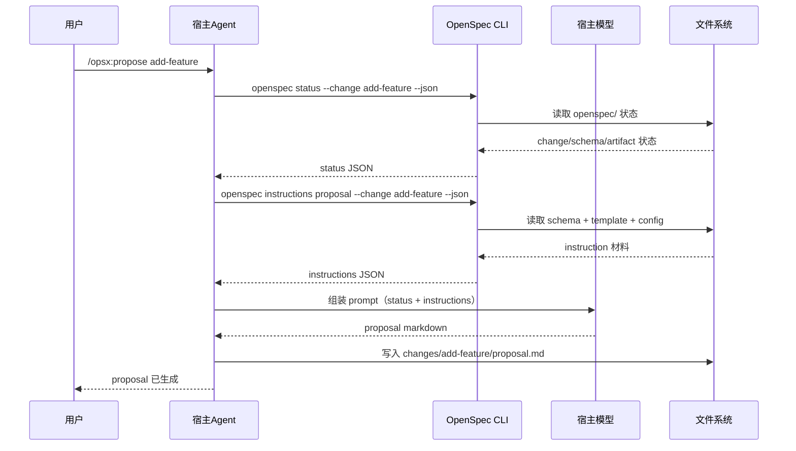

# 90 · 附录：给机器看的 Agent 协议

> 这一篇不是给第一次上手的人看的，而是给想研究"OpenSpec 怎么喂给宿主 agent"的人看的。
>
> **适用版本**：本文以 OpenSpec v1.7.0 为准；涵盖 `--json` 输出、PlanningHome 路由，以及 Apply/Archive operation inputs。

---

## 先明确三方角色

```text
用户  ←→  宿主 Agent（Claude Code / Cursor / Codex 等）  ←→  OpenSpec CLI
```

三者分工是：

- **用户**：提需求、选命令、确认方向
- **宿主 Agent**：理解命令、调用 CLI、把上下文喂给自己的模型、生成内容
- **OpenSpec CLI**：读写文件、解析 schema、计算 artifact 状态、返回结构化上下文

最关键的一句：

> **OpenSpec 自己不是 LLM，它是 prompt 编排器和状态引擎。**

这里也要避免一个术语误会：`/opsx:*` 只是支持 command adapter 的宿主采用的一种命名空间，不是另一套运行时。Codex 在 v1.7.0 使用 `$openspec-*` skills，不生成 `/opsx:*` command。机器协议里的事实来源仍然是 `openspec` CLI 和 `openspec/` 文件状态。

---

## 对机器来说，最重要的不是页面文档，而是结构化查询

宿主 agent 并不是靠"读完整本手册"来工作的。

它更依赖几类运行时查询，例如：

- `openspec status --json`
- `openspec instructions <artifact> --json`
- `openspec instructions apply --json`
- `openspec instructions archive --json`
- `openspec schemas`
- `openspec templates`

这些命令提供的是机器可消费的上下文，而不是给人看的长篇解释。

### 这些查询分别在干什么

| 命令 | 机器拿来做什么 | 人类可理解成 |
|------|---------------|-------------|
| `openspec status --json` | 判断当前 change 到哪一步了、哪些 artifact 已完成 | 看项目仪表盘 |
| `openspec instructions <artifact> --json` | 生成某个 artifact 时拿到模板、规则、上下文、输出路径 | 拿到一份"写作任务单" |
| `openspec instructions apply --json` | 获取 Apply 的 artifact 文件、项目 context 与 apply guidance | 拿到一份"实施任务单" |
| `openspec instructions archive --json` | 获取 Archive 的项目 context 与 archive guidance | 拿到一份"归档前置输入" |
| `openspec schemas` | 获取可用的 change 结构定义 | 看有哪几种工作流骨架 |
| `openspec templates` | 获取每类 artifact 的文本模板 | 看每种文档的推荐写法 |

---

## 一次典型执行链

以 `propose` 为例：



所以：

- skill/command 负责"告诉 agent 怎么做"
- CLI 负责"给 agent 真实上下文"
- LLM 负责"真正写内容和做推理"

### `openspec status --json` 示例（简化）

```json
{
  "change": "add-task-csv-export",           // 当前 change 名称
  "schema": "spec-driven",                    // 使用的 schema
  "artifacts": {
    "proposal": { 
      "status": "done",                       // 已完成
      "path": "changes/add-task-csv-export/proposal.md" 
    },
    "specs": { 
      "status": "done",                       // 已完成
      "path": "changes/add-task-csv-export/specs/" 
    },
    "design": { 
      "status": "in_progress",                // 进行中
      "path": "changes/add-task-csv-export/design.md" 
    },
    "tasks": { 
      "status": "todo",                       // 待开始
      "path": "changes/add-task-csv-export/tasks.md" 
    }
  },
  "nextRecommended": "design"                 // 建议下一步做什么
}
```

**字段说明**：
- `status`：可能的值是 `todo`（待做）、`in_progress`（进行中）、`done`（完成）
- `nextRecommended`：CLI 根据依赖关系推荐下一步应该生成哪个 artifact

### `openspec instructions design --json` 示例（简化）

```json
{
  "artifact": "design",                       // 要生成的 artifact 类型
  "change": "add-task-csv-export",           // 所属 change
  "outputPath": "openspec/changes/add-task-csv-export/design.md",  // 输出路径
  "template": "# Design\n\n## Approach\n## Decisions\n## Risks\n",  // 文本模板
  "instruction": "Describe technical approach and key tradeoffs.",   // 生成指令
  "context": "Stack: TypeScript, React, Node.js",                    // 项目背景（来自 config.yaml）
  "rules": [                                                          // 写作规则（来自 config.yaml）
    "Explain migration risk when behavior changes existing flow",
    "Do not bypass domain module boundaries"
  ],
  "dependencies": ["proposal", "specs"]       // 依赖哪些 artifact（应该先读它们）
}
```

**字段说明**：
- `template`：文档的骨架结构
- `instruction`：告诉 AI 这个 artifact 应该写什么
- `context`：项目级背景信息，帮助 AI 生成更符合项目的内容
- `rules`：项目级约束，确保生成的内容符合团队规范
- `dependencies`：生成前应该先读哪些 artifact，确保内容一致

机器真正依赖的是这些结构化字段，而不是给人阅读的文档。

---

## skill、command、workflow 的关系

这三个词很容易混，但它们不是同一层：

| 名词 | 它是什么 |
|------|----------|
| workflow | 一个工作流动作，例如 propose / apply / archive |
| skill | 给宿主 agent 看的能力说明书 |
| command | 给用户触发的命令入口模板 |

所以一个更准确的理解是：

- workflow 是"动作 ID"
- skill/command 是"投递方式"
- CLI 是"运行时事实来源"

`OPSX: Propose`、`OPSX: Apply` 这类名字只是部分工具中的 workflow 显示标签。Claude Code 等工具可用 `/opsx:propose` 触发动作；Codex 则使用 `$openspec-propose` 等 skills。无论入口语法如何，动作执行过程中仍然要回到 `openspec status --json`、`openspec instructions ... --json` 这些 CLI API。

---

## 给人的翻译：机器协议到底在服务什么

如果你不是在写宿主集成代码，可以把这篇浓缩成三句话：

1. 机器并不是"自己想写什么就写什么"，而是先问 CLI 拿结构化上下文
2. CLI 给的是"当前状态 + 本artifact任务单 + 项目规则"，不是随便一段提示词
3. OpenSpec 的输出之所以更稳定，正是因为它把 AI 放进了一个有状态、有边界的运行时框架

---

## 下一步

如果你是在研究宿主集成，推荐回到这些主题篇检验理解：

- [`10` 实战·Claude Code 落地](10-实战-claude-code-里的-openspec-到底怎么落地.md) — 二层架构与入口投递
- [`04` 高级·config/schema 边界](04-高级-config-schema-与项目边界.md) — schema 与 workflow 的关系
- [`03` 高级·生命周期思想](03-高级-openspec-的软件开发生命周期思想.md) — 为什么 OpenSpec 把 AI 放进有边界的运行时

如果是第一次上手，这篇不该先读——从 [`01`](01-初级-先把-openspec-用起来.md) 初级篇开始更顺。
