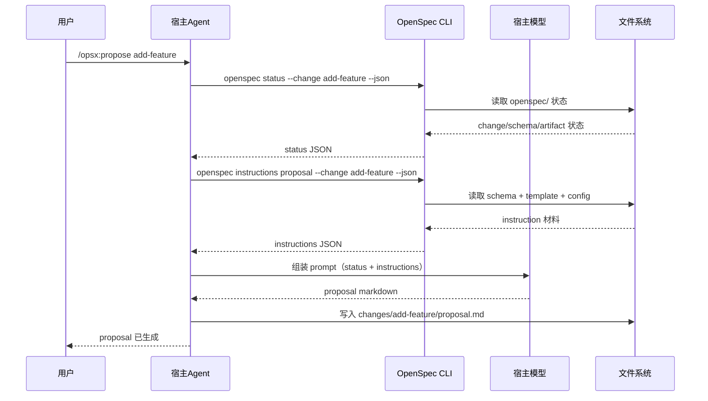

# 90 · 附录：给机器看的 Agent 协议

> 这一篇不是给第一次上手的人看的，而是给想研究"OpenSpec 怎么喂给宿主 agent"的人看的。
>
> **适用版本**：见 [00-index 的「对齐 OpenSpec」](00-index.md#版本与维护)。涵盖 `--json` 输出、PlanningHome 路由、store-aware specs instruction、Apply/Archive operation inputs、`validate --report findings` 报告、`show --diff` 与 `status --all`。首次遥测披露和 completion tip 在 `--json` 时都会被推迟，避免污染机器输出。

---

## 先明确三方角色

```text
用户  ←→  宿主 Agent（Claude Code / Cursor / Codex 等）  ←→  OpenSpec CLI
```

三者分工是：

- **用户**：提需求、选命令、确认方向
- **宿主 Agent**：理解命令、调用 CLI、把上下文喂给自己的模型、生成内容
- **OpenSpec CLI**：读写文件、解析 schema、计算 artifact 状态、返回结构化上下文

最关键的一句：

> **OpenSpec 自己不是 LLM，它是 prompt 编排器和状态引擎。**

这里也要避免一个术语误会：`/opsx:*` 只是支持 command adapter 的宿主采用的一种命名空间，不是另一套运行时。Codex 使用 `$openspec-*` skills，不生成 `/opsx:*` command。机器协议里的事实来源仍然是 `openspec` CLI 和 `openspec/` 文件状态。

---

## 对机器来说，最重要的不是页面文档，而是结构化查询

宿主 agent 并不是靠"读完整本手册"来工作的。

它更依赖几类运行时查询，例如：

- `openspec status --json`
- `openspec instructions <artifact> --json`
- `openspec instructions apply --json`
- `openspec instructions archive --json`
- `openspec schemas`
- `openspec templates`

这些命令提供的是机器可消费的上下文，而不是给人看的长篇解释。

### 这些查询分别在干什么

| 命令 | 机器拿来做什么 | 人类可理解成 |
|------|---------------|-------------|
| `openspec status --json` | 判断当前 change 到哪一步了、哪些 artifact 已完成 | 看项目仪表盘 |
| `openspec instructions <artifact> --json` | 生成某个 artifact 时拿到模板、规则、上下文、输出路径和 `planningHome` | 拿到一份"写作任务单" |
| `openspec instructions apply --json` | 获取 Apply 的 artifact 文件、项目 context 与 apply guidance | 拿到一份"实施任务单" |
| `openspec instructions archive --json` | 获取 Archive 的项目 context 与 archive guidance | 拿到一份"归档前置输入" |
| `openspec schemas` | 获取可用的 change 结构定义 | 看有哪几种工作流骨架 |
| `openspec templates` | 获取每类 artifact 的文本模板 | 看每种文档的推荐写法 |

---

## 一次典型执行链

以 `propose` 为例：



所以：

- skill/command 负责"告诉 agent 怎么做"
- CLI 负责"给 agent 真实上下文"
- LLM 负责"真正写内容和做推理"

### `openspec status --change <name> --json` 示例（精简字段）

```json
{
  "changeName": "add-task-csv-export",
  "schemaName": "spec-driven",
  "planningHome": {
    "kind": "repo",
    "root": "/srv/stores/platform-api",
    "changesDir": "/srv/stores/platform-api/openspec/changes",
    "defaultSchema": "spec-driven"
  },
  "changeRoot": "/srv/stores/platform-api/openspec/changes/add-task-csv-export",
  "artifacts": [
    { "id": "proposal", "outputPath": "proposal.md", "status": "done" },
    { "id": "specs",    "outputPath": "specs/**/*.md", "status": "done" },
    { "id": "design",   "outputPath": "design.md", "status": "ready" },
    { "id": "tasks",    "outputPath": "tasks.md", "status": "blocked", "missingDeps": ["design"] }
  ],
  "isPlanningComplete": false,
  "nextSteps": ["Run openspec instructions design --change \"add-task-csv-export\" --json before writing that artifact."],
  "actionContext": {
    "mode": "repo-local",
    "sourceOfTruth": "repo",
    "allowedEditRoots": ["/project"],
    "constraints": ["Repo-local change artifacts and implementation edits are scoped to this project."]
  }
}
```

**字段说明**：
- `planningHome.root`：这次 change 实际所属 OpenSpec root。specs instruction 要求从 `<root>/openspec/specs/<capability-path>/spec.md` 读取 main spec；它可能来自 `--store`、项目 `store:` pointer、global default store 或当前 repo。
- `planningHome.changesDir`：active/archive change 的确定性父目录；不要从 cwd 猜。
- `artifacts[].status`：`done`（文件存在）| `ready`（依赖满足、可写）| `blocked`（缺依赖）| `skipped`（change 声明 `skip_specs` 后跳过、视为已满足）
- `isPlanningComplete`：所有非 skipped planning artifact 都存在才算完成（主字段；`isComplete` 是兼容别名，二者同值）
- `nextSteps`：数组，给 agent 的建议下一步命令
- `actionContext`：机器可读约束（`mode` 恒为 `repo-local`，`allowedEditRoots` 指向 project root）

### `openspec instructions design --json` 示例（简化）

```json
{
  "changeName": "add-task-csv-export",                             // 所属 change
  "planningHome": {
    "kind": "repo",
    "root": "/srv/stores/platform-api",
    "changesDir": "/srv/stores/platform-api/openspec/changes",
    "defaultSchema": "spec-driven"
  },
  "artifactPath": "openspec/changes/add-task-csv-export/design.md", // 实际输出路径
  "resolvedOutputPath": "openspec/changes/add-task-csv-export/design.md", // 应该写到的绝对/相对路径
  "template": "# Design\n\n## Approach\n## Decisions\n## Risks\n",  // 文本模板
  "instruction": "Describe technical approach and key tradeoffs.",   // 生成指令
  "context": "Stack: TypeScript, React, Node.js",                    // 项目背景（来自 config.yaml）
  "rules": [                                                          // 写作规则（来自 config.yaml）
    "Explain migration risk when behavior changes existing flow",
    "Do not bypass domain module boundaries"
  ],
  "dependencies": [{ "id": "proposal", "done": true, "path": "proposal.md", "description": "..." }], // 依赖 artifact（应先读）
  "unlocks": ["tasks"]                                                // 完成后会解锁哪些 artifact
}
```

**字段说明**：
- `template`：文档的骨架结构
- `instruction`：告诉 AI 这个 artifact 应该写什么
- `context`：项目级背景信息，帮助 AI 生成更符合项目的内容
- `rules`：项目级约束，确保生成的内容符合团队规范
- `dependencies`：生成前应该先读哪些 artifact，确保内容一致

当 artifact 是 `specs` 且要写 MODIFIED delta 时，机器必须使用 `planningHome.root` 定位 main spec，不能把 `artifactPath`、cwd 或调用 CLI 的 repo root 当成 main-spec root。这个字段解决 root；它不自动检索“哪些 capability 与当前需求相关”。

机器真正依赖的是这些结构化字段，而不是给人阅读的文档。

### `openspec instructions apply --json`（关键字段）

```json
{
  "state": "blocked",
  "contextFiles": ["proposal.md", "specs/orders/spec.md"],
  "progress": { "total": 5, "completed": 2, "remaining": 3 },
  "tasks": [ "..." ],
  "context": "Stack: ...",
  "guidance": "...",                             // operations.apply.guidance（如有）
  "missingArtifacts": ["specs"],
  "missingPrerequisites": ["specs", "design"],   // 完整 build order 缺失链
  "warning": "Change has no delta specs ...",    // 无 specs 且未声明 skip_specs 时
  "instruction": "..."
}
```

**字段说明**：
- `missingPrerequisites`：按 build order 收集的完整缺失链；文本模式对应 `Not created yet, in build order: ...`。此前只报第一跳（`missingArtifacts`）。
- `warning`：change 无 delta specs 且未声明 `skip_specs: true` 时给出，附两条出路（先写 specs / 声明 `skip_specs`）；有 specs、声明了 marker、或仍被自身必需 artifact 挡住时不受影响。

### `validate --report findings` / `show --diff` / `status --all` 的 JSON

- `validate --report findings --all|--changes|--specs|--archived --json` 产出**独立** report：`{ "report": { "kind": "validation-findings", "scope": ... }, ... }`。只含有 error/warning/information 的条目，保留全量总数和退出码；须配显式 scope、不能带 item name、`archived` 与 active scope 不能混用（违规输出 `invalid_validation_report_request`）。delta 与 main spec 的合并冲突作为 informational findings 出现，不改退出码。
- `show <change> --diff --json`：既有 payload 形状不变，在 MODIFIED delta 上加 `diff` 和 `warning` 字段；`--store <id>` 可对 store 做 diff。
- `status --all --json`：`{ "changes": [<status>, ...], "root": ... }` 按 change name 稳定排序；单 change 加载失败贡献 `{ "changeName", "status": [diagnostic] }` 而非中止全扫；部分失败 exit 1。

---

## skill、command、workflow 的关系

这三个词很容易混，但它们不是同一层：

| 名词 | 它是什么 |
|------|----------|
| workflow | 一个工作流动作，例如 propose / apply / archive |
| skill | 给宿主 agent 看的能力说明书 |
| command | 给用户触发的命令入口模板 |

所以一个更准确的理解是：

- workflow 是"动作 ID"
- skill/command 是"投递方式"
- CLI 是"运行时事实来源"

`OPSX: Propose`、`OPSX: Apply` 这类名字只是部分工具中的 workflow 显示标签。Claude Code 等工具可用 `/opsx:propose`；Codex 使用 `$openspec-propose`；Zed Agent 是 skills-only，通常使用 `/openspec-propose` 或 `@openspec-propose`。Codex、Zed、Antigravity（从 `.agent` 迁入）与 vendor-neutral `agents` 共用 `.agents/skills/`，由 `resolveSharedSkillWriters()` 通用仲裁每个物理 root 的单一写入者；OpenSpec 只管理 `openspec-*` 目录和 ownership marker，不改根 `AGENTS.md`。SourceCraft Code Assistant 走 adapter 路线，写 `.codeassistant/commands/opsx-<id>.md`。

OpenCode 同时有 skills 和 `.opencode/commands/opsx-*.md` command。adapter 会在生成 command 时加入 `$ARGUMENTS`，把用户在 command 后输入的参数交给 workflow；模板正文已有等价参数占位时不会再重复追加。不要把这个占位符复制到 Claude、Codex 或 Zed 的调用语法里。

---

## 给人的翻译：机器协议到底在服务什么

如果你不是在写宿主集成代码，可以把这篇浓缩成三句话：

1. 机器并不是"自己想写什么就写什么"，而是先问 CLI 拿结构化上下文
2. CLI 给的是"当前状态 + 本artifact任务单 + 项目规则"，不是随便一段提示词
3. OpenSpec 的输出之所以更稳定，正是因为它把 AI 放进了一个有状态、有边界的运行时框架

---
